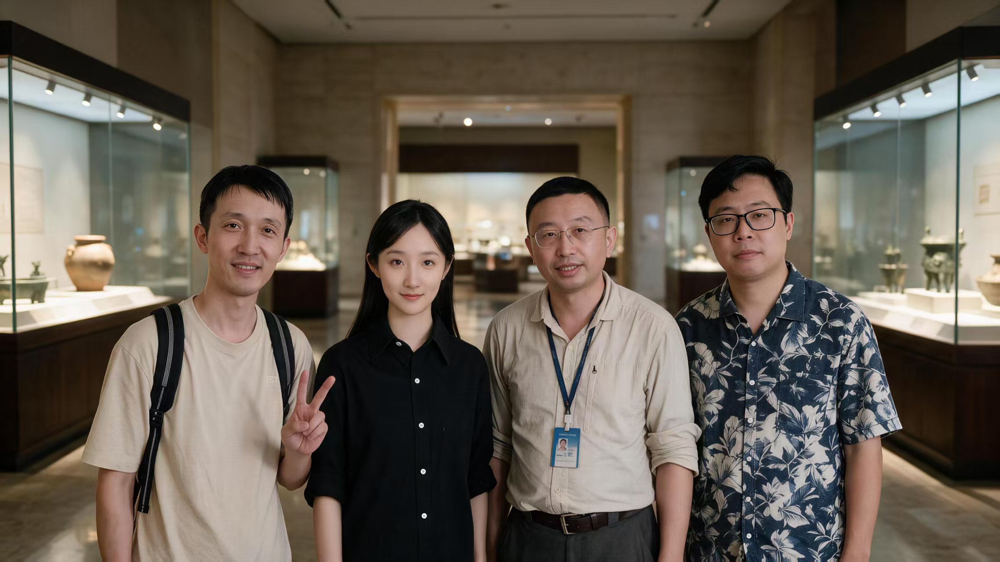

# WanderInk

## 📖项目简介

**项目起名：**

WanderInk - 景区有声连环画 Agent，中文名称为"漫游墨绘"。Wander 寓意漫游探索，Ink 象征笔墨绘画。中文"漫游墨绘"既有探索之旅的意境，又有传统文化韵味。

**项目内容：**

WanderInk 是一个面向景区文化 IP 开发的多模态创作项目，围绕"景区名称 → 历史故事 → 剧本创作 → 分镜脚本 → 角色设计 → 漫画生成 → 配音配乐 → 有声连环画"构建完整闭环。

**项目背景与动机：**

- **行业痛点**：景区文化 IP 开发严重依赖人工创作团队（编剧、画师、配音、配乐），制作周期长、成本高，中小景区难以负担；
- **现有 AI 方案不足**：通用 LLM 只能生成文本，图片生成模型缺乏角色一致性，TTS/音乐生成与画面脱节，没有端到端的全链路自动化方案；
- **机会**：Nvidia DGX Spark 128GB 统一内存使得多模型协同推理成为可能，将故事生成、图像生成、语音合成、音乐生成压缩到单机流水线中，实现"景区名称进、有声连环画出"的全自动化。

本仓库包含基于 ComfyUI 的图像生成管线和 API 服务，实现从文本到图像、音频的全链路自动化生成。

- **端到端全链路自动化**：从景区名称到最终有声连环画，功能模块全自动串联，无需人工干预；
- **角色一致性保障**：通过 Qwen-Image-Edit-2511 + LoRA 微调，在分镜漫画生成阶段保持人物外观一致性（三视图 → 分镜复用）；
- **多模型分时编排**：DGX Spark 统一内存约束下，LLM、图像编辑模型、TTS 模型、音乐生成模型分时加载，峰值不超内存上限；
- **NVIDIA 全栈落地**：DGX Spark 统一内存 + Stepfun系列（LLM/TTS）+ ACE-STEP 音乐生成 + ComfyUI 图像管线，展示完整创意 AI 生命周期；
- **Skill 模块化设计**：部分功能模块抽象为独立 Skill（剧本：编剧 skill、分镜：导演 skill等），支持灵活扩展新场景。

> 详细产品方案见 [docs/product/](docs/product/景区有声连环画%20Agent%20—%20产品方案（优化版）.md)

## Demo

> [Demo 视频（bilibili）](https://www.bilibili.com/video/BV1ymK865Et1)

## 一句话 Pitch

**景区名称进 → 有声连环画（MP4）出**，端到端自动化，支持分步预览与重生成。

## 流水线（S0–S6）

```
输入景区名
  → [S0] LEGEND 传说检索与甄别
  → [S1] SCRIPT 剧本改编
  → [S2] BOARD 分镜设计
  → [S3] ROLE 角色设定（三视图，锁定外观一致性）
  → [S4] PAGES 连环画页生成
  → [S5] VOICE 配音 + MUSIC 配乐
  → [S6] FILM 合成输出 MP4
```

## 🗺️技术架构

本项目专为 **NVIDIA DGX Spark (GB10 128G 统一内存)** 量身定制。采用 **"多模型分时编排" (Multi-Model Time-Slice Scheduling)** 架构。

### Agent 角色定义

| Agent          | 职责     | 核心能力            |
| -------------- | ------ | --------------- |
| StoryAgent     | 景区故事生成 | 检索历史背景、生成故事概要   |
| ScriptAgent    | 剧本与分镜  | 故事改编、分镜拆分       |
| CharacterAgent | 角色描述生成 | 人物小传、道具描述       |
| ImageAgent     | 图像生成   | 角色三视图、分镜漫画、图像编辑 |
| VoiceAgent     | 分镜配音   | Qwen3-TTS 语音合成  |
| MusicAgent     | 背景配乐   | ACE-STEP 音乐生成   |
| ComposerAgent  | 最终合成   | 漫画+语音+音乐合成      |

### 技术栈

- **文本模型**：Sehyo-Qwen3.5-35B-A3B-NVFP4（本地）、Step-3.7-Flash（云端）：<https://modelscope.cn/models/hf/Sehyo-Qwen3.5-35B-A3B-NVFP4>
- **图像编辑模型**：Qwen-Image-Edit-2511（本地） 、openAI GPT Image2（云端）：<https://modelscope.cn/models/Qwen/Qwen-Image-Edit-2511>
- **语音合成模型**：Qwen3-TTS：<https://modelscope.cn/models/Qwen/Qwen3-TTS-12Hz-1.7B-Base>
- **音乐生成模型**：ACE-STEP XL Turbo（ACE Studio 与 StepFun）：<https://modelscope.cn/models/ACE-Step/acestep-v15-xl-turbo>
- **框架**：ComfyUI、FastAPI + Pydantic + ThreadPoolExecutor、React 18 + Vite 5 + Tailwind CSS + TypeScript

## 🚀 快速开始

### 1. 环境要求

- **硬件**：NVIDIA DGX Spark (GB10 128G 统一内存) 或等效 GPU
- **操作系统**：Ubuntu 24.04
- **Python**：3.12+（Anaconda）

### 2. 系统安装

#### 2.1 安装ComfyUI环境

```bash
#使用wuzi用户登录
source ~/.bashrc

#安装依赖
sudo apt-get install -y sox libsox-fmt-all

#创建conda环境
conda create -n comfyui python=3.12 -y
conda activate comfyui

#下载ComfyUI代码仓
cd ~
git clone https://github.com/comfyanonymous/ComfyUI.git

#根据显卡 CUDA 版本安装对应的 PyTorch
pip3 install torch torchvision torchaudio --index-url https://download.pytorch.org/whl/cu130

#安装ComfyUI依赖
cd ~/ComfyUI
pip install -r requirements.txt
```

编辑\~/.config/systemd/user/comfyui.service文件，配置systemctl常驻服务

```
[Unit]
Description=ComfyUI User Service
After=network.target

[Service]
Type=simple
WorkingDirectory=/home1/wuzi/ComfyUI
Environment="HF_ENDPOINT=https://hf-mirror.com"
ExecStart=/home1/wuzi/anaconda3/bin/conda run --no-capture-output -n comfyui python main.py --listen 0.0.0.0 --port 8188 --use-flash-attention --gpu-only
Restart=always
RestartSec=10
StandardOutput=journal
StandardError=journal

[Install]
WantedBy=default.target
```

#### 2.2 安装Web服务环境

```
#使用huntun用户登录
source ~/.bashrc

#下载代码仓
git clone https://github.com/zhanghui-china/WanderInk 
cd ~/WanderInk/web

#按环境填写端点与模型
cp .env.example .env   

#创建uv环境
uv sync
uv run shanhai-web

#安装web环境
cd web/web
bun install && bun run dev
```

编辑\~/.config/systemd/user/shanhai-web.service文件，配置systemctl常驻服务

```
[Unit]
Description=shanhai web (FastAPI + SPA)
After=network-online.target
Wants=network-online.target
RequiresMountsFor=%h/shanhai

[Service]
WorkingDirectory=%h/shanhai
EnvironmentFile=%h/shanhai/.env
Environment="PATH=%h/.local/bin:/usr/local/sbin:/usr/local/bin:/usr/sbin:/usr/bin:/sbin:/bin:/usr/games:/usr/local/games:/snap/bin"
ExecStart=%h/.local/bin/uv run shanhai-web
Restart=always
RestartSec=3

[Install]
WantedBy=default.target
```

编辑\~/.config/systemd/user/shanhai-image.service文件，配置systemctl常驻服务

```
[Unit]
Description=shanhai image shim (ComfyUI, OpenAI-compatible)
After=network-online.target
Wants=network-online.target
RequiresMountsFor=%h/image-shim

[Service]
WorkingDirectory=%h/image-shim
Environment="PATH=%h/.local/bin:/usr/local/sbin:/usr/local/bin:/usr/sbin:/usr/bin:/sbin:/bin"
ExecStart=%h/image-shim/.venv/bin/uvicorn main:app --host 127.0.0.1 --port 8091
Restart=always
RestartSec=5

[Install]
WantedBy=default.target
```

编辑\~/.config/systemd/user/shanhai-tts.service文件，配置systemctl常驻服务

```
[Unit]
Description=shanhai TTS shim (Qwen3-TTS VoiceDesign via ComfyUI, OpenAI-compatible)
After=network-online.target
Wants=network-online.target
RequiresMountsFor=%h/qwentts-shim

[Service]
WorkingDirectory=%h/qwentts-shim
Environment="PATH=%h/.local/bin:/usr/local/sbin:/usr/local/bin:/usr/sbin:/usr/bin:/sbin:/bin"
ExecStart=%h/qwentts-shim/.venv/bin/uvicorn main:app --host 127.0.0.1 --port 8090
Restart=always
RestartSec=5

[Install]
WantedBy=default.target
```

编辑\~/.config/systemd/user/shanhai-music.service文件，配置systemctl常驻服务

```
[Unit]
Description=shanhai music shim (ACE-Step via ComfyUI, OpenAI-compatible)
After=network-online.target
Wants=network-online.target
RequiresMountsFor=%h/music-shim

[Service]
WorkingDirectory=%h/music-shim
Environment="PATH=%h/.local/bin:/usr/local/sbin:/usr/local/bin:/usr/sbin:/usr/bin:/sbin:/bin"
ExecStart=%h/music-shim/.venv/bin/uvicorn main:app --host 127.0.0.1 --port 8092
Restart=always
RestartSec=5

[Install]
WantedBy=default.target
```

#### 2.3 安装Hermes环境

参考 <https://zhuanlan.zhihu.com/p/2056830749530142643>

为安全起见，hermes环境跟wanderink的运行环境隔离，避免出现hermes获取高权限后删除项目代码和文档的情况。

```
#使用hermes用户登录
source ~/.bashrc

#安装依赖
sudo apt install ripgrep

#安装hermes
curl -fsSL https://hermes-agent.nousresearch.com/install.sh | bash

#配置hermes
hermes setup
```

#### 2.4 模型下载

##### 2.4.1 下载LLM模型：Sehyo-Qwen3.5-35B-A3B-NVFP4

编辑download\_model\_by\_modelscope\_Sehyo-Qwen3.5-35B-A3B-NVFP4.py文件：

```
from modelscope import snapshot_download
import os

model_id = "hf/Sehyo-Qwen3.5-35B-A3B-NVFP4"
local_dir = "/home1/wuzi/models/"

model_dir = snapshot_download(
    model_id,
    local_dir=local_dir,
    revision='master'
)

print(f"下载完成，文件保存在: {model_dir}")
```

下载模型：

```
python download_model_by_modelscope_Sehyo-Qwen3.5-35B-A3B-NVFP4.py
```

##### 2.4.2 下载ComfyUI图像编辑模型：Qwen-Image-Edit-2511

> \[!NOTE]
> 系统的 `~/ComfyUI/models` 目录是一个软链接，实际指向真实存储目录 `~/models/comfyui_models`。以下操作将模型文件直接下载保存到真实目录中。

下载 `qwen_image_edit_2511_fp8mixed.safetensors` 并保存到 `~/models/comfyui_models/diffusion_models/` 目录下。

可以通过以下几种方式之一进行下载：

- **使用 wget（推荐，使用国内镜像加速）**：
  ```bash
  export HF_ENDPOINT=https://hf-mirror.com # 国内镜像源加速
  huggingface-cli download Comfy-Org/Qwen-Image-Edit_ComfyUI split_files/diffusion_models/qwen_image_edit_2511_fp8mixed.safetensors --local-dir ~/models/comfyui_models/diffusion_models --local-dir-use-symlinks False

  # 下载完成后将文件移动至正确根目录并清理多余空目录
  mv ~/models/comfyui_models/diffusion_models/split_files/diffusion_models/qwen_image_edit_2511_fp8mixed.safetensors ~/models/comfyui_models/diffusion_models/
  rm -rf ~/models/comfyui_models/diffusion_models/split_files
  ```
- **使用 huggingface-cli**：
  ```
  # 创建目录（若不存在）
  mkdir -p ~/models/comfyui_models/diffusion_models

  # 下载模型文件
  wget -O ~/models/comfyui_models/diffusion_models/qwen_image_edit_2511_fp8mixed.safetensors \
    https://hf-mirror.com/Comfy-Org/Qwen-Image-Edit_ComfyUI/resolve/main/split_files/diffusion_models/qwen_image_edit_2511_fp8mixed.safetensors
  ```

##### 2.4.3 下载ComfyUI语音合成模型：Qwen3-TTS

需要下载完整的 `Qwen/Qwen3-TTS-12Hz-1.7B-VoiceDesign` 仓库，并保存到 `~/models/comfyui_models/qwen-tts/Qwen3-TTS-12Hz-1.7B-VoiceDesign` 目录下。

可以通过以下几种方式之一进行下载：

- **使用 huggingface-cli（推荐，国内镜像加速）**：
  ```
  # 创建目录（若不存在）
  mkdir -p ~/models/comfyui_models/qwen-tts/Qwen3-TTS-12Hz-1.7B-VoiceDesign

  # 下载完整的模型仓库
  export HF_ENDPOINT=https://hf-mirror.com # 国内镜像源加速
  huggingface-cli download Qwen/Qwen3-TTS-12Hz-1.7B-VoiceDesign \
    --local-dir ~/models/comfyui_models/qwen-tts/Qwen3-TTS-12Hz-1.7B-VoiceDesign \
    --local-dir-use-symlinks False
  ```

* **使用 git clone（需要已安装 git-lfs）**：
  ```bash
  # 克隆仓库到指定位置
  git clone https://hf-mirror.com/Qwen/Qwen3-TTS-12Hz-1.7B-VoiceDesign ~/models/comfyui_models/qwen-tts/Qwen3-TTS-12Hz-1.7B-VoiceDesign
  ```
* **官方 Hugging Face 链接**：
  [Qwen3-TTS-12Hz-1.7B-VoiceDesign](https://huggingface.co/Qwen/Qwen3-TTS-12Hz-1.7B-VoiceDesign/tree/main)

##### 2.4.4 下载ComfyUI音乐生成模型：ACE-STEP XL Turbo

下载音乐生成模型 `acestep1.5XL_ComfyUI_aio-marduk191.safetensors` 并保存到 `~/models/comfyui_models/checkpoints/` 目录下。

可以通过以下几种方式之一进行下载：

- **使用 wget（推荐，使用国内镜像加速）**：
  ```bash
  export HF_ENDPOINT=https://hf-mirror.com # 国内镜像源加速
  huggingface-cli download marduk191/acestep1.5XL_ComfyUI_aio-marduk191 acestep1.5XL_ComfyUI_aio-marduk191.safetensors --local-dir ~/models/comfyui_models/checkpoints --local-dir-use-symlinks False
  ```
- **使用 huggingface-cli**：
  ```bash
  # 创建目录（若不存在）
  mkdir -p ~/models/comfyui_models/vae

  # 下载模型文件
  wget -O ~/models/comfyui_models/vae/qwen_image_vae.safetensors \
    https://hf-mirror.com/Comfy-Org/Qwen-Image_ComfyUI/resolve/main/split_files/vae/qwen_image_vae.safetensors
  ```
- **官方 Hugging Face 链接**：
  [acestep1.5XL\_ComfyUI\_aio-marduk191.safetensors](https://huggingface.co/marduk191/acestep1.5XL_ComfyUI_aio-marduk191/tree/main)

##### 2.4.5 下载ComfyUI VAE模型

下载 `qwen_image_vae.safetensors` 并保存到 `~/models/comfyui_models/vae/` 目录下。

可以通过以下几种方式之一进行下载：

- **使用 wget（推荐，使用国内镜像加速）**：
  ```
  export HF_ENDPOINT=https://hf-mirror.com # 国内镜像源加速
  huggingface-cli download marduk191/acestep1.5XL_ComfyUI_aio-marduk191 acestep1.5XL_ComfyUI_aio-marduk191.safetensors --local-dir ~/models/comfyui_models/checkpoints --local-dir-use-symlinks False
  ```
- **官方 Hugging Face 链接**：
  [qwen\_image\_vae.safetensors](https://huggingface.co/Comfy-Org/Qwen-Image_ComfyUI/blob/main/split_files/vae/qwen_image_vae.safetensors)

##### 2.4.6 下载ComfyUI CLIP/Text Encoder模型

需要下载 `qwen_2.5_vl_7b.safetensors` 和 `qwen3vl_4b_bf16.safetensors` 并保存到 `~/models/comfyui_models/text_encoders/` 目录下。

可以通过以下几种方式之一进行下载：

- **使用 wget（推荐，使用国内镜像加速）**：

```
# 创建目录（若不存在）
mkdir -p ~/models/comfyui_models/text_encoders

# 下载 qwen_2.5_vl_7b
wget -O ~/models/comfyui_models/text_encoders/qwen_2.5_vl_7b.safetensors \
  https://hf-mirror.com/Comfy-Org/Qwen-Image_ComfyUI/resolve/main/split_files/text_encoders/qwen_2.5_vl_7b.safetensors

# 下载 qwen3vl_4b_bf16
wget -O ~/models/comfyui_models/text_encoders/qwen3vl_4b_bf16.safetensors \
  https://hf-mirror.com/Comfy-Org/Krea-2/resolve/main/text_encoders/qwen3vl_4b_bf16.safetensors
```

- **使用 huggingface-cli**：
  ```bash
  # 创建目录（若不存在）
  mkdir -p ~/models/comfyui_models/checkpoints

  # 下载模型文件
  wget -O ~/models/comfyui_models/checkpoints/acestep1.5XL_ComfyUI_aio-marduk191.safetensors \
    https://hf-mirror.com/marduk191/acestep1.5XL_ComfyUI_aio-marduk191/resolve/main/acestep1.5XL_ComfyUI_aio-marduk191.safetensors
  ```
- **官方 Hugging Face 链接**：
  - [qwen\_2.5\_vl\_7b.safetensors](https://huggingface.co/Comfy-Org/Qwen-Image_ComfyUI/blob/main/split_files/text_encoders/qwen_2.5_vl_7b.safetensors)
  - [qwen3vl\_4b\_bf16.safetensors](https://huggingface.co/Comfy-Org/Krea-2/blob/main/text_encoders/qwen3vl_4b_bf16.safetensors)

##### 2.4.7 下载ComfyUI LoRA模型

###### 2.4.7.1 Qwen-Image-Edit-2511

需要下载 `Qwen-Image-Edit-2511-Lightning-4steps-V1.0-bf16.safetensors` 并保存到 `~/models/comfyui_models/loras/` 目录下。

可以通过以下几种方式之一进行下载：

- **使用 wget（推荐，使用国内镜像加速）**：
  ```
  # 创建目录（若不存在）
  mkdir -p ~/models/comfyui_models/loras

  # 下载 LoRA 模型文件
  wget -O ~/models/comfyui_models/loras/Qwen-Image-Edit-2511-Lightning-4steps-V1.0-bf16.safetensors \
    https://hf-mirror.com/lightx2v/Qwen-Image-Edit-2511-Lightning/resolve/main/Qwen-Image-Edit-2511-Lightning-4steps-V1.0-bf16.safetensors
  ```
- **官方 Hugging Face 链接**：
  [Qwen-Image-Edit-2511-Lightning-4steps-V1.0-bf16.safetensors](https://huggingface.co/lightx2v/Qwen-Image-Edit-2511-Lightning/blob/main/Qwen-Image-Edit-2511-Lightning-4steps-V1.0-bf16.safetensors)

###### 2.4.7.2 其他Lora模型

其他Lora模型可到 civital.com 进行下载，下载完毕后，保存到 `~/models/comfyui_models/loras/` 目录下。

- **Lora模型链接**：
  - [Real\_ani\_qwen](https://civitai.com/models/2164588/gen-ani-art-style-qwen-lora)
  - [Qwen-image\_2511\_Edit\_Ball-jointed\_Doll V2.0](https://civitai.com/models/2303022/qwen-image2511editball-jointeddoll-v20)
  - [Nano banana figurine style](https://civitai.com/models/1900696/nano-banana-figurine-style-qwen-image-edit)

#### 2.5 下载vllm docker镜像

```
docker pull vllm/vllm-openai:cu130-nightly
```

### 3.系统启动

#### 3.1 启动ComfyUI服务

```bash
#使用wuzi用户登录
source ~/.bashrc

#启动ComfyUI常驻服务
systemctl --user restart comfyui
systemctl --user status comfyui
```

服务将在 `8188`端口 启动。

```
(comfyui) wuzi@gx10-8e22:~$ systemctl --user status comfyui
● comfyui.service - ComfyUI User Service
     Loaded: loaded (/home1/wuzi/.config/systemd/user/comfyui.service; enabled; preset: enabled)
     Active: active (running) since Sat 2026-07-18 05:08:30 UTC; 11h ago
   Main PID: 86108 (conda)
      Tasks: 88 (limit: 153553)
     Memory: 8.6G (peak: 38.6G swap: 2.4G swap peak: 2.8G)
        CPU: 1h 37min 33.782s
     CGroup: /user.slice/user-1002.slice/user@1002.service/app.slice/comfyui.service
             ├─86108 /home1/wuzi/anaconda3/bin/python /home1/wuzi/anaconda3/bin/conda run --no-capture-output -n comfyui python main.py --listen 0.0.0.0 --por
             ├─86109 /usr/bin/bash /tmp/tmptj92d21u
             └─86116 python main.py --listen 0.0.0.0 --port 8188 --use-flash-attention --gpu-only

Jul 18 16:24:42 gx10-8e22 conda[86116]: [INFO] Prompt executed in 57.45 seconds
Jul 18 16:24:44 gx10-8e22 conda[86116]: [INFO] got prompt
Jul 18 16:25:38 gx10-8e22 conda[86116]: [394B blob data]
Jul 18 16:25:41 gx10-8e22 conda[86116]: [INFO] Prompt executed in 57.30 seconds
Jul 18 16:25:42 gx10-8e22 conda[86116]: [INFO] got prompt
Jul 18 16:26:37 gx10-8e22 conda[86116]: [394B blob data]
Jul 18 16:26:40 gx10-8e22 conda[86116]: [INFO] Prompt executed in 57.44 seconds
Jul 18 16:26:41 gx10-8e22 conda[86116]: [INFO] got prompt
Jul 18 16:27:07 gx10-8e22 conda[86116]: [394B blob data]
Jul 18 16:27:09 gx10-8e22 conda[86116]: [INFO] Prompt executed in 28.26 seconds
```

#### 3.2 启动Web服务

```bash
#使用huntun用户登录
source ~/.bashrc

# 启动 Web、TTS、图像和音乐服务
systemctl --user start shanhai-web shanhai-tts shanhai-image shanhai-music

# 查看服务状态
systemctl --user status shanhai-web shanhai-tts shanhai-image shanhai-music
```

服务将在 `8090、8091、8092`端口 启动。

```
(base) huntun@gx10-8e22:~$ systemctl --user status shanhai-web shanhai-tts shanhai-image shanhai-music
● shanhai-web.service - shanhai web (FastAPI + SPA)
     Loaded: loaded (/home1/huntun/.config/systemd/user/shanhai-web.service; enabled; preset: enabled)
     Active: active (running) since Sat 2026-07-18 08:45:35 UTC; 7h ago
   Main PID: 98952 (uv)
      Tasks: 11 (limit: 153553)
     Memory: 320.9M (peak: 7.4G swap: 33.3M swap peak: 33.3M)
        CPU: 16min 18.501s
     CGroup: /user.slice/user-1007.slice/user@1007.service/app.slice/shanhai-web.service
             ├─98952 /home1/huntun/.local/bin/uv run shanhai-web
             └─98963 /home1/huntun/shanhai/.venv/bin/python3 /home1/huntun/shanhai/.venv/bin/shanhai-web

Jul 18 16:20:40 gx10-8e22 uv[98963]: INFO:     192.168.199.160:12451 - "GET /api/queue HTTP/1.1" 200 OK

● shanhai-tts.service - shanhai TTS shim (Qwen3-TTS VoiceDesign via ComfyUI, OpenAI-compatible)
     Loaded: loaded (/home1/huntun/.config/systemd/user/shanhai-tts.service; enabled; preset: enabled)
     Active: active (running) since Sat 2026-07-18 08:45:35 UTC; 7h ago
   Main PID: 98953 (uvicorn)
      Tasks: 1 (limit: 153553)
     Memory: 38.5M (peak: 42.1M swap: 16.6M swap peak: 16.6M)
        CPU: 42.400s
     CGroup: /user.slice/user-1007.slice/user@1007.service/app.slice/shanhai-tts.service
             └─98953 /home1/huntun/qwentts-shim/.venv/bin/python3 /home1/huntun/qwentts-shim/.venv/bin/uvicorn main:app --host 127.0.0.1 --port 8090

Jul 18 09:30:16 gx10-8e22 uvicorn[98953]: INFO:     127.0.0.1:57484 - "POST /v1/audio/speech HTTP/1.1" 200 OK


● shanhai-image.service - shanhai image shim (ComfyUI, OpenAI-compatible)
     Loaded: loaded (/home1/huntun/.config/systemd/user/shanhai-image.service; enabled; preset: enabled)
     Active: active (running) since Sat 2026-07-18 08:45:35 UTC; 7h ago
   Main PID: 98954 (uvicorn)
      Tasks: 6 (limit: 153553)
     Memory: 42.3M (peak: 60.3M swap: 9.4M swap peak: 10.5M)
        CPU: 41.412s
     CGroup: /user.slice/user-1007.slice/user@1007.service/app.slice/shanhai-image.service
             └─98954 /home1/huntun/image-shim/.venv/bin/python3 /home1/huntun/image-shim/.venv/bin/uvicorn main:app --host 127.0.0.1 --port 8091

Jul 18 16:21:49 gx10-8e22 uvicorn[98954]: INFO:     127.0.0.1:51546 - "POST /v1/images/edits HTTP/1.1" 200 OK

● shanhai-music.service - shanhai music shim (ACE-Step via ComfyUI, OpenAI-compatible)
     Loaded: loaded (/home1/huntun/.config/systemd/user/shanhai-music.service; enabled; preset: enabled)
     Active: active (running) since Sat 2026-07-18 08:45:35 UTC; 7h ago
   Main PID: 98955 (uvicorn)
      Tasks: 1 (limit: 153553)
     Memory: 15.7M (peak: 37.7M swap: 21.3M swap peak: 21.3M)
        CPU: 40.654s
     CGroup: /user.slice/user-1007.slice/user@1007.service/app.slice/shanhai-music.service
             └─98955 /home1/huntun/music-shim/.venv/bin/python /home1/huntun/music-shim/.venv/bin/uvicorn main:app --host 127.0.0.1 --port 8092

Jul 18 08:45:35 gx10-8e22 systemd[2249]: Started shanhai-music.service - shanhai music shim (ACE-Step via ComfyUI, OpenAI-compatible).
Jul 18 08:45:35 gx10-8e22 uvicorn[98955]: INFO:     Started server process [98955]
Jul 18 08:45:35 gx10-8e22 uvicorn[98955]: INFO:     Waiting for application startup.
Jul 18 08:45:35 gx10-8e22 uvicorn[98955]: INFO:     Application startup complete.
Jul 18 08:45:35 gx10-8e22 uvicorn[98955]: INFO:     Uvicorn running on http://127.0.0.1:8092 (Press CTRL+C to quit)
(base) huntun@gx10-8e22:~$
```

#### 3.3 启动Hermes服务

```bash
#使用hermes用户登录
source ~/.bashrc

hermes gateway restart
```

#### 3.4 LLM模型启动

编辑文件：/home1/wuzi/models/Sehyo/Qwen3.5-35B-A3B-NVFP4/model\_qwen35\_p8000.yaml

```
host: "0.0.0.0"
port: 8000
reasoning-parser: "qwen3"
enable-auto-tool-choice: true
tool-call-parser: "qwen3_xml"
dtype: auto
max-model-len: 128K
api-key: "sk-my-api-key"
disable-custom-all-reduce: true
generation-config: "vllm"
gpu-memory-utilization: 0.3
language-model-only: true
```

编辑文件：/home1/wuzi/docker/docker\_start\_Sehyo-Qwen3.5-35B-A3B-NVFP4.sh文件：

```
docker run -d --gpus all --rm \
       -v /home1/wuzi/models/Sehyo/:/mnt/ \
       -p 0.0.0.0:8000:8000/tcp \
       --name qwen35_35b_a3b vllm/vllm-openai:cu130-nightly /mnt/Qwen3.5-35B-A3B-NVFP4 \
       --served-model-name DGX-Qwen3.5-35B-A3B \
       --api_key "sk-my-api-key" \
       --config /mnt/Qwen3.5-35B-A3B-NVFP4/model_qwen35_p8000.yaml \
       --speculative-config '{"method": "mtp", "num_speculative_tokens": 1}'
```

使用docker方式启动Sehyo-Qwen3.5-35B-A3B-NVFP4：

```
cd /home1/wuzi/docker
chmod +x docker_start_Sehyo-Qwen3.5-35B-A3B-NVFP4.sh
sh ./docker_start_Sehyo-Qwen3.5-35B-A3B-NVFP4.sh
docker ps
docker logs [containerid]
```

## ✨项目报告

[项目报告](https://github.com/zhanghui-china/WanderInk/blob/main/docs/%E9%A1%B9%E7%9B%AE%E8%AF%B4%E6%98%8E%E6%96%87%E6%A1%A3.md)

## 📋项目代码结构

```
WanderInk/
├── comfyui-bridge/       # ComfyUI HTTP 桥接服务
│   ├── workflows/        # 图像 / TTS / 音乐 JSON 工作流模板
│   ├── test/             # CLI 测试脚本
│   ├── comfyui_api_service.py
├── docs/                 # 项目文档
│   ├── product/          # 产品方案
│   ├── guides/           # DGX / Ollama / ComfyUI 运维手册
│   ├── demo/             # （可选）放置 Demo 视频文件
│   ├── Web技术白皮书.md
│   ├── Web端操作手册.md
│   └── 项目说明文档.md
├── samples/              # 生成作品示例
│   ├── mp4/              # 有声连环画视频
│   ├── pdf/              # PDF 漫画书
│   ├── png/              # 漫画页图片
│   └── opr/              # 操作手册截图
└── web/                  # 主应用（FastAPI + React）
    ├── src/shanhai/      # 后端流水线 S0–S6
    │   ├── providers/    # Provider层（LLM/图像/TTS/音乐）
    │   ├── steps/        # 各阶段实现（S0-S6）
    │   ├── api.py        # FastAPI 接口定义
    │   ├── cli.py        # 命令行工具
    │   ├── config.py     # 配置管理
    │   ├── store.py      # 数据持久化
    │   └── schema.py     # 数据模型定义
    ├── web/              # 前端（React + Vite + Tailwind）
    │   ├── src/
    │   │   ├── components/  # React 组件
    │   │   ├── data/        # 静态数据
    │   │   └── api.ts       # API 客户端
    │   └── vite.config.ts
    ├── assets/           # 字体、BGM 等静态资源
    ├── docs/             # PRD、决策记录、规格文档
    │   ├── decisions/    # 决策记录（0001-0006）
    │   └── superpowers/  # 计划与规格文档
    ├── tests/            # 单元测试（300+ 用例）
    ├── scripts/          # 辅助脚本
    ├── spike/            # 实验代码
    └── .env.example      # 环境变量模板

```

## 文档索引

| 位置                                                                 | 内容                          |
| -------------------------------------------------------------------- | ----------------------------- |
| [docs/项目说明文档.md](docs/项目说明文档.md)                         | 项目说明文档（中文）           |
| [docs/项目说明文档_en.md](docs/项目说明文档_en.md)                   | 项目说明文档（英文）           |
| [docs/product/](docs/product/)                                       | 产品方案（优化版）             |
| [docs/guides/](docs/guides/)                                         | ComfyUI / Ollama / DGX 运维手册 |
| [docs/Web技术白皮书.md](docs/Web技术白皮书.md)                       | Web技术白皮书                 |
| [docs/Web端操作手册.md](docs/Web端操作手册.md)                       | Web端操作手册                 |
| [web/docs/](web/docs/)                                               | PRD、决策记录                  |
| [web/docs/deploy-dgx.md](web/docs/deploy-dgx.md)                     | DGX 部署说明                  |
| [web/.env.example](web/.env.example)                                 | 环境变量模板                  |
| [comfyui-bridge/README.md](comfyui-bridge/README.md)                 | 桥接服务说明                  |

## 📆更新说明及团队动态

[2026.7.21] **张小白**编写 WanderInk体验手册，参见：https://zhuanlan.zhihu.com/p/2062795404199073593 。Nancy编制DEMO讲解视频，参见：https://www.bilibili.com/video/BV1ymK865Et1 。 **般度五子**制作团队合影。

[2026.7.20] **Nancy**编制项目演示PPT。

\[2026.7.19] **张小白**、**般度五子**完善部署文档、项目介绍文档等。

\[2026.7.18]  项目组成员对项目进行一系列测试验证，**馄饨**对Web端BUG进行修复后，Web端代码封版。

\[2026.7.15]  项目组成员对 WanderInk产品进行密集测试。项目团队测试中发现Spark设备突然远程连不上了，**张小白**发现Spark自动熄火了。**馄饨**在**轻踏**的支持下，将LLM生成剧本和分镜，改为通过调用Hermes skill生成。

\[2026.7.14]  **张小白**对项目组成员进行任务分工，**般度五子**和**馄饨**把重点放在BugFix和代码优化上，其他人重点是对项目代码进行测试，争取7.18文档和代码能出一版。文本模型开始使用赞助方提供的step-3.7-flash模型。各开发者提交代码到本代码仓。

\[2026.7.13]  **张小白**发现图像编辑模型调用时结果都是黑的，经般度五子检查发现是启动时增加了sage attention加速造成的，改回flash-attn加速就解决了。张小白重新包装了ComfyUI的HTTP服务并测试通过。

\[2026.7.12]  WanderInk团队参加上午的黑客松线上训练营活动，并开始群里图文直播。**般度五子**在Spark上配置和启动了Ollama本地模型。

\[2026.7.10]  **馄饨**提交了项目前端原型。

\[2026.7.7]  **Nancy**提交了通过LLM生成景区故事的代码和文档。由于项目团队成员**LZH**的因故退出，WanderInk团队召集新成员**馄饨**（来自无锡）。

\[2026.7.4]  **张小白**在DGX Spark设备上安装了Hermes，参见：<https://zhuanlan.zhihu.com/p/2056830749530142643>

\[2026.7.3]  **张小白**尝试将**般度五子**的ComfyUI服务包装成HTTP服务。

\[2026.7.2]  WanderInk团队召开第二次视频会议（LZH因故未能参加会议），基本确定了**有声连环画**的项目方向。

\[2026.7.1]  **般度五子**完成了ComfyUI安装、部署、使用文档的编写。张小白完成了对Stepfun的Step-3.7-Flash-GGUF模型的下载和部署尝试，参见：<https://zhuanlan.zhihu.com/p/2055024035302471223>

\[2026.6.30]  **轻踏**研究山音的编剧大师和导演大师skill，尝试迭代提示词，并在Spark上安装Claude Code，跑出了结果。**Nancy**在进行ComfyUI的Lora模型的尝试。**般度五子**进行了单图、双图、三图进行图像编辑的ComfyUI环境验证，调通了语音TTS的生成，并建议**Nancy**找一些新模型的Lora。

\[2026.6.29]  **张小白** 对Stepfun的Step-3.7-Flash-NVFP4模型进行下载和部署尝试。第二天宣布docker方式和conda方式都因内存不足启动失败。

\[2026.6.28]  **般度五子**在Spark上部署ComfyUI环境，他还花了好长时间源码编译了flash-attention，使用ACE-STEP XL Turbo生成了音乐，并开始了ComfyUI生成图像的测试验证。**轻踏**开始研究 Eazo（<https://creator.eazo.ai/apps）>

\[2026.6.27]  **张小白**购买了内网穿透云服务，提供ssh通道和http通道方式供团队成员共享使用张小白自己的Spark设备。张小白创建本代码仓。

\[2026.6.26]  WanderInk团队召集新成员**轻踏**，召开第一次视频会议（轻踏因故未能参加会议），进行头脑风暴。团队成员加入某飞书企业组织及带有OpenClaw机器人的飞书群（**LZH**因故未加入）。

\[2026.6.25]  WanderInk队名确定，召集新成员**般度五子**（来自无锡）。

\[2026.6.24]  WanderInk团队成员召集，**张小白**（张辉，来自南京）、**Nancy**（粟小叶，来自成都）、**LZH**（来自杭州）开始讨论项目方向。

## 📆项目团队

| 成员                                        | 职责                                                |
| ------------------------------------------- | --------------------------------------------------- |
| [张小白](https://github.com/zhanghui-china) | 队长、项目策划、环境部署、项目测试、文档编写        |
| [Nancy](https://github.com/nancysxy000)     | 队员、文档编制、景区故事生成、DEMO视频制作          |
| [轻踏](https://github.com/DoubleCore)       | 队员、Skill 开发、Hermes 对接、编剧/导演 skill 迭代 |
| [般度五子](https://github.com/Bandukids)    | 队员、ComfyUI 服务部署与开发、图像/音频管线         |
| [馄饨](https://github.com/nativeas)         | 队员、Web 前后台开发、前端交互与多用户设计          |



## 💖特别鸣谢

感谢 Nvidia 主办 第二届DGX Spark黑客松活动


感谢 赞奇科技 提供赛事支持


感谢 阶跃星辰 提供模型和在线算力支持


感谢  [@山音](https://github.com/Shanyin-ai)  提供专业化开源skill支持


## 开源协议

本项目采用 [Apache License 2.0](https://github.com/comfyanonymous/ComfyUI/blob/master/LICENSE) 开源许可证。
