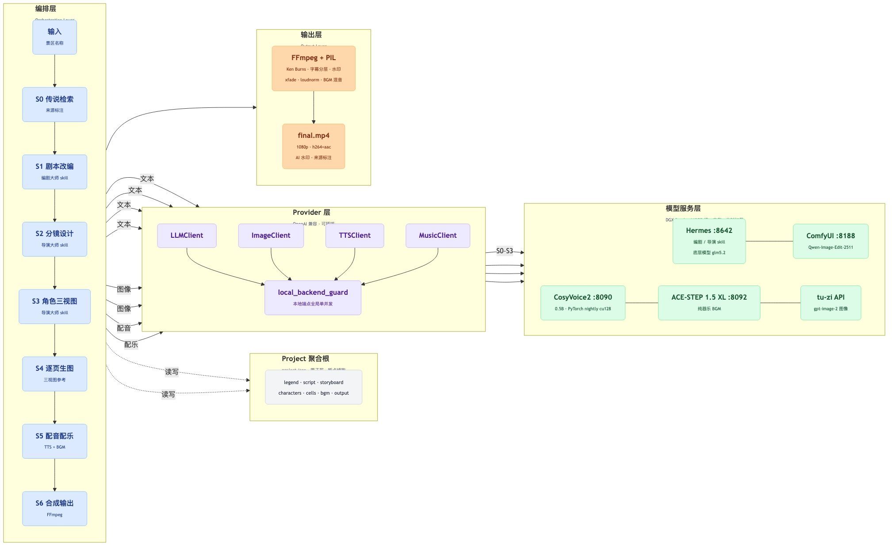

# WanderInk（漫游墨绘）项目说明文档

> 版本：v1.0（赛事评审版）  
> 更新时间：2026-07-16  
> 适用赛事：第二届 NVIDIA DGX Spark 黑客松

---

## 一、项目概述

**WanderInk（中文名“漫游墨绘”）** 是一款面向景区文化 IP 开发的端到端多模态创作系统。用户只需输入一个景区名称，系统即可自动完成传说检索、剧本改编、分镜设计、角色设定、连环画绘制、配音配乐与视频合成，最终输出一部可播放、可分享的 **1080p 有声连环画短视频**。

核心 slogan：

> **景区名称进，有声连环画出。**

本项目在第一届 Spark 黑客松项目 [SparkScroll](https://github.com/zhanghui-china/SparkScroll) 的产品理念基础上进行了全面升级：从“纯漫画”升级为“有声有画的多媒体叙事”，从“大模型直接生成剧本”升级为“引入电影业界编剧/导演 skill 的专业化创作”，从“全自动黑盒”升级为“分步可干预、可重跑、可审校的创作工作台”，从“后台网关为主”升级为“支持多用户协作、界面友好的完整 Web 应用”。本届团队除队长外引入了更多具备影视、AI 工程、前后端全栈经验的专业人才。

---

## 二、作品特点与核心亮点

### 2.1 端到端全链路自动化

系统把景区故事创作拆分为 **S0–S6 七个顺序步骤**，覆盖文本、图像、语音、音乐、视频五种模态，单条流水线即可从“景区名”直达“MP4 成片”，无需人工切换工具：

| 步骤 | 名称 | 产出物 |
|---|---|---|
| S0 | 传说检索与甄别 | 2–5 条候选传说及来源标注 |
| S1 | 剧本改编 | 结构化剧本（幕/场/对白/旁白） |
| S2 | 分镜设计 | 分页分镜表（画面描述/情绪/文案） |
| S3 | 角色设定 | 角色卡 + 正/侧/背三视图 |
| S4 | 连环画页生成 | 逐页 1920×1080 画面 |
| S5 | 配音配乐 | 逐页解说音频 + BGM |
| S6 | 合成输出 | 带字幕/水印/片尾的 MP4 |

### 2.2 角色一致性无需训练

项目最大技术亮点是 **“三视图 + 参考图注入”** 的角色一致性方案：

- S3 为每个主要角色生成正/侧/背三视图；
- S4 将三视图缩放到 768px 后作为图像参考图传入生成请求；
- 配合固定画风前缀与角色特征 prompt，约束跨页形象。

在 M0 一致性门禁中，白蛇传 2 角色 × 3 画风 × 24 张图的抽样评估达到 **100% 零身份漂移**，标志道具（银簪、纸伞等）全程保留，验证了“不微调 LoRA 也能保持高一致性”的工程路径。

### 2.3 音画同步与健壮音频

- S5 按真实音频时长写回 `duration_ms`，S6 据此精确计算每页长度与转场 offset；
- TTS 采用“整段单发优先 + 截断检测退化到分句 + 三试取最长”的策略，兼容强模型与弱模型；
- 当 TTS 完全不可用时，系统按字数估算时长生成静音兜底轨，保证成片结构完整、不残缺。

### 2.4 分步可干预的创作工作台

与完全自动的“一键到底”不同，WanderInk 默认支持分步确认：

- 每步产物均在前端可视化预览；
- 用户可修改剧本、调整分镜、重绘单页、重配单音、拖拽排序；
- 任意步骤崩溃后，基于 `project.json` 的断点续跑机制只补缺失部分，不重做已完成工作。

### 2.5 专业化 Skill 驱动

项目引入 **Hermes agent**（底层配置 glm5.2 模型）承载“编剧大师”与“导演大师”两个专业 skill，覆盖 S0–S3 全部文本生成环节：

- **编剧大师 skill**：负责 S0 传说检索与 S1 剧本改编，输出更符合影视叙事结构（冷开场、起承转合、主角 ≤4）的剧本；
- **导演大师 skill**：负责 S2 分镜拆分与 S3 角色特征提取，输出带镜头语言（全景/中景/特写、光线、氛围）与情绪标签的分镜表。

Hermes 的接入为流水线注入了电影行业知识，使生成内容从“通用 LLM 出文本”升级为“受专业创作方法论约束的结构化产出”。WanderInk 只需通过 OpenAI 兼容协议以 `hermes-agent` 作为模型名调用该服务，底层模型与 skill prompt 的组合由 Hermes 内部托管。

---

## 三、技术实现方案

### 3.1 整体架构

项目采用 **“Supervisor + 顺序流水线 + 可插拔 Provider”** 架构：

- **单一 `Project` 聚合根**：所有中间态（候选传说、剧本、分镜、角色卡、页面产物、输出）都挂在同一个 Pydantic `Project` 对象上，序列化为 `projects/<id>/project.json`，是唯一事实源；
- **OpenAI 兼容 Provider 层**：LLM / Image / TTS / Music 四个 provider 全部走 OpenAI 兼容协议，通过 `.env` 或 Web 配置面板切换端点、模型、密钥，业务代码零改动；
- **CLI / HTTP 双入口**：`shanhai`（Typer CLI）与 `shanhai-web`（FastAPI）复用同一套 `steps/*` 与 provider 层，HTTP 端将管线丢入后台线程，前端轮询进度；
- **FFmpeg 函数式合成**：`ffmpeg.py` 纯命令构造，S6 按“片头卡 → 逐页 → 片尾卡 → xfade 拼接 → 响度归一化 + BGM”串联落地。

#### 整体架构图

> 源文件：[architecture.mmd](architecture.mmd)（Mermaid 源码）
> 渲染命令：`mmdc -i architecture.mmd -o architecture.png -w 2400 -H 1600 -b white`

> **图例说明**：
> - 浅蓝 = 编排层（S0–S6 流水线），浅紫 = Provider 层（OpenAI 兼容客户端 + local_backend_guard），浅绿 = 模型服务层（DGX Spark + 云端图像），浅橙 = 输出层（FFmpeg 合成），浅灰 = Project 聚合根。
> - 节点采用 pastel 浅色填充 + 圆角 + 小号灰色注释文字，模仿现代架构图风格。
> - `Project` 聚合根是唯一事实源，所有步骤读写同一个 `project.json`，支持断点续跑。
> - S0–S3 文本环节全部走 Hermes 编剧/导演 skill（底层 glm5.2）；图像走 tu-zi 云端 gpt-image-2。
> - 严格按已确认事实绘制，未引入任何未经证实的数据或具体数字。

#### 流水线各环节模型与端点配置

下面这张表与架构图、`config.json` 当前值一一对应，反映 S0–S5 各环节实际调用的“生效模型 / 端点”：

| 环节 | 用途 | 生效模型 | 端点 |
|---|---|---|---|
| S0 传说 | LLM | `hermes-agent`（编剧大师 skill，底层 glm5.2） | `127.0.0.1:8642`（DGX 本地） |
| S1 剧本 | LLM | `hermes-agent`（编剧大师 skill，底层 glm5.2） | `127.0.0.1:8642`（DGX 本地） |
| S2 分镜 | LLM | `hermes-agent`（导演大师 skill，底层 glm5.2） | `127.0.0.1:8642`（DGX 本地） |
| S3 角色三视图 | LLM + 图像 | `hermes-agent`（导演大师 skill，底层 glm5.2）+ `gpt-image-2` | `127.0.0.1:8642` + `api.tu-zi.com`（tu-zi 云端） |
| S4 漫画页 | 图像 | `gpt-image-2` | `api.tu-zi.com`（tu-zi 云端） |
| S5 配音/BGM | TTS + 音乐 | `cosyvoice2` + `ace-step-v1.5xl` | 都在 `127.0.0.1`（DGX 本地 shim） |

> **说明**：
> - S0–S3 的 LLM 环节全部走本地 Hermes Agent（`127.0.0.1:8642`），由 Hermes 内部托管的 **glm5.2** 模型配合编剧大师 / 导演大师 skill prompt 生成，受电影业界创作方法论约束。
> - S3 三视图与 S4 逐页图像走 tu-zi 云端 `gpt-image-2`；三视图在 M0 门禁中以 100% 零身份漂移通过。
> - S5 配音与 BGM 全部由 DGX 本地 shim 提供（`shanhai-tts` :8090 跑 CosyVoice2-0.5B，`shanhai-music` :8092 跑 ACE-STEP 1.5 XL），受 `local_backend_guard` 全局单并发锁保护。

### 3.2 多 Agent 角色设计

| Agent | 职责 | 底层能力 / 端点 |
|---|---|---|
| StoryAgent | 景区 → 历史故事概要（S0） | Hermes 编剧大师 skill（底层 glm5.2，`127.0.0.1:8642`） |
| ScriptAgent | 故事 → 剧本（S1） | Hermes 编剧大师 skill（底层 glm5.2，`127.0.0.1:8642`） |
| DirectorAgent | 剧本 → 分镜（S2） | Hermes 导演大师 skill（底层 glm5.2，`127.0.0.1:8642`） |
| CharacterAgent | 剧本 → 人物小传与道具描述（S3） | Hermes 导演大师 skill（底层 glm5.2，`127.0.0.1:8642`） |
| ImageAgent | 角色三视图、分镜漫画（S3/S4） | tu-zi `gpt-image-2`（`api.tu-zi.com`），参考图由 ComfyUI 准备 |
| VoiceAgent | 分镜文本 → 解说语音（S5） | CosyVoice2-0.5B（DGX 本地 :8090）/ Qwen3-TTS（桥接） |
| MusicAgent | 情绪标签 → 背景音乐（S5） | ACE-STEP 1.5 XL（DGX 本地 :8092） |
| ComposerAgent | 画面 + 语音 + 音乐 → MP4（S6） | FFmpeg + PIL 排版 |

### 3.3 关键技术细节

- **字幕与画面分层**：`compose_page()` 只出 1920×1080 满幅底图，`overlay_layer()` 单独生成透明 PNG 承载字幕与“AI 生成”水印；ffmpeg 中 overlay 在 Ken Burns 缩放之后叠加，避免文字随镜头抖动或水印被裁出画面。
- **原子写与可重入**：`store.save()` 采用“写 `.tmp` 后 `os.replace`”的原子写，每步落盘；S3 `locked` 幂等、S4/S5 产物存在性校验，支持任意步骤崩溃后断点续跑。
- **本地后端全局单并发**：`providers/_http.py` 通过 `local_backend_guard` 自动识别 `127.0.0.1`/`localhost` 端点，对 DGX Spark 上共享 GPU 的 Ollama/ComfyUI/CosyVoice2/ACE-Step 进行全局排队，避免多任务抢卡导致超时。
- **按环节配置覆盖**：Web 配置面板支持“全局默认 + S0–S5 按环节覆盖”，例如 S0–S3 全部走 Hermes 编剧/导演 skill（底层 glm5.2），图像走云端或本地 ComfyUI，无需重启即可生效。

---

## 四、架构设计思路与优化方案

### 4.1 DGX Spark 平台适配思路

DGX Spark（GB10，119GB 统一内存）的核心约束是“多模型无法同时驻留”。因此本项目没有试图把所有模型同时加载，而是采用 **分时加载 + 本地服务 shim + 全局单并发锁** 的策略：

1. **文本阶段**：Ollama 本地 LLM（glm-4.7-flash / qwen3.5:122b / step-3.7-flash）常驻约 40GB；
2. **图像阶段**：通过 `shanhai-image.service` 桥接到 ComfyUI（Qwen-Image-Edit-2511 / Krea2）；
3. **音频阶段**：`shanhai-tts.service`（CosyVoice2-0.5B）与 `shanhai-music.service`（ACE-STEP 1.5 XL）分时复用 GPU；
4. **合成阶段**：ComposerAgent 仅消耗约 2GB，使用 FFmpeg 完成最终输出。

这种设计充分发挥了 DGX Spark **大统一内存、单机多模态协同、本地闭环推理** 的平台优势。

### 4.2 已落地的关键优化

| 优化项 | 问题 | 方案 | 效果 |
|---|---|---|---|
| 角色一致性 | 跨页人物形象漂移 | 三视图参考图 + 768px 缩图上传 + 固定画风前缀 | M0 门禁 100% 通过 |
| 竖图填充 | gpt-image-2 出竖图导致黑边 | 完整画面居中 + 同图模糊压暗填充两侧 | 成片观感专业 |
| S4 并发 | 逐页串行太慢 | ThreadPool 上限 3，本地 GPU 自动串行 | 云端场景提速约 23% |
| 静音兜底 | TTS 不可用导致成片残缺 | 字数估算时长生成静音轨 | 端到端即使 TTS 全失败也能出片 |
| 网络容错 | 代理瞬时 503/RemoteProtocolError | 捕获完整 `httpx.TransportError` 家族并指数退避 | 真实 DGX 部署稳定性提升 |
| 配置面板 | 改端点需改文件重启 | Web UI 运行时覆盖，持久化到 `config.json` | 无需重启即可切换模型 |
| GPU TTS | DGX 无在线 TTS | 部署 CosyVoice2 shim，PyTorch nightly 适配 GB10 sm_121 | 本地真人声已跑通 |
| AI BGM | 曲库为空 | ACE-STEP 1.5 XL 本地生成纯器乐 BGM | S5 已可输出真实配乐 |

### 4.3 规划中的优化

以下功能已在设计文档中明确，将在后续迭代中落地：

- **Ollama 原生适配器**：通过 `/api/chat` + `think:false` 将 S0–S2 从约 15 分钟降到约 1.5 分钟；
- **多用户登录与队列可见性**：Cookie session + `users.json`，支持团队共用、只看自己的取消权限；
- **单页多格漫画排版**：当前一页一格，后续支持日式多格分镜；
- **角色库跨项目复用**：将锁定角色存入全局库，减少重复生成；
- **PDF 精排版与多语言输出**：面向 B 端景区运营方；
- **成本上限与重绘预算控制**：防止远程 API 额度失控。

---

## 五、AI 合规性处理与敏感信息管理

本项目将 AI 内容合规作为**不可关闭的硬规则**内建到合成流程：

1. **每页“AI 生成”水印**：透明 overlay 层右上角恒定显示描边水印，不随 Ken Burns 镜头运动失效；
2. **片尾全局声明**：片尾 credits 明确标注“本片为 AI 生成内容”；
3. **来源精确标注**：按 `source_type` 区分“正史 / 地方志 / 民间传说 / 文学作品 / 原创演绎”，原创演绎不冒充传说来源；
4. **敏感内容过滤**：S0 对涉及宗教、民族、近现代政治人物的候选传说进入敏感审校清单；用户手册明确提示此类景区可走“自备故事”路径；
5. **儿童向内容保护**：儿童受众自动规避暴力/恐怖细节；
6. **版权边界**：用户上传自备故事需自行承诺权利；系统输出物明确标注来源与 AI 生成身份。

未来规划：引入输入/输出双侧内容安全过滤 API，对文生图 prompt 与生成结果进行自动审核。

---

## 六、平台适配性：NVIDIA DGX Spark + 开源模型 + Stepfun

| 层级 | 技术/模型 | 用途 |
|---|---|---|
| 硬件平台 | NVIDIA DGX Spark（GB10，119GB 统一内存） | 单机承载 LLM + 图像 + TTS + 音乐全链路推理 |
| LLM | Ollama（glm-4.7-flash / qwen3.5:122b）+ Stepfun step-3.7-flash | 故事/剧本/分镜/角色描述 |
| 图像 | ComfyUI + Qwen-Image-Edit-2511 / Krea2 Turbo | 三视图、分镜漫画、图像编辑 |
| 语音 | CosyVoice2-0.5B（本地 GPU）/ Qwen3-TTS（桥接） | 解说配音 |
| 音乐 | ACE-STEP 1.5 XL | 背景音乐生成 |
| 编排 | FastAPI + ThreadPool + FFmpeg | 流水线调度与视频合成 |

Stepfun 阶跃星辰提供的 `step-3.7-flash` 模型作为文本生成主路径之一，显著提升了剧本与分镜的推理质量；NVIDIA DGX Spark 的统一内存与本地 GPU 能力使“单机关闭环、无需外部云服务”成为可能。

---

## 七、项目完整性

- **功能完整**：S0–S6 七个步骤全部跑通，前端支持新建、预览、编辑、重绘、重配音、下载 PDF/图片包；
- **前后端完整**：后端 FastAPI + 前端 React + Vite + Tailwind，支持多用户、队列、分享链接；
- **运行稳定**：单元测试 300+ 用例覆盖核心路径，真实端到端已产出雷峰塔、黄鹤楼等成片；
- **文档规范**：包含 PRD、产品方案、部署手册、用户手册、决策记录（decisions 0001–0006）、整库调研报告；
- **可演示**：输入景区名后，前端实时展示每步进度与耗时，最终可播放 MP4。

---

## 八、演示效果

Demo 计划按以下脚本展示：

| 幕次 | 时长 | 内容 | 展示要点 |
|---|---|---|---|
| 第 1 幕 | 30s | 问题引入：景区 IP 创作周期长、成本高 | 行业痛点数据 |
| 第 2 幕 | 30s | 输入“雷峰塔/西湖”→ S0/S1 自动生成传说与剧本 | Web 实时进度 |
| 第 3 幕 | 60s | 角色三视图 + 逐页漫画生成 | 三视图与连环画页 |
| 第 4 幕 | 45s | 配音配乐与最终合成 | 播放语音与 BGM 片段 |
| 第 5 幕 | 15s | 成品播放 + 数据：1 个景区名 → 1 部有声连环画 | 完整 MP4 播放 |

---

## 九、赛事征文：DGX Spark 黑客松“十日谈”开发历程

WanderInk 的诞生贯穿了第二届 DGX Spark 黑客松的完整周期，团队称之为“十日谈”：

- **D1–D2（6.24–6.25）**：队名确定，成员召集，头脑风暴确定“有声连环画”方向；
- **D3–D4（6.28–6.29）**：般度五子在 DGX Spark 上部署 ComfyUI，源码编译 flash-attention，验证 ACE-STEP 音乐生成；张小白尝试 Stepfun 模型部署；
- **D5–D6（6.30–7.1）**：轻踏研究山音编剧/导演 skill，Nancy 尝试 ComfyUI LoRA，团队安装 Claude Code；
- **D7–D8（7.7–7.10）**：Nancy 提交景区故事生成代码，馄饨加入并提交前端原型；
- **D9–D10（7.11–7.15）**：DGX 部署 systemd 服务化，GPU TTS、本地 AI BGM、Web 配置面板、Hermes 编剧 skill 相继上线，前端完成“天青烟雨”视觉改版与多用户设计。

关键踩坑与修复记录均写入 `web/docs/decisions/`，体现了团队在真实硬件约束下的工程迭代能力。

---

## 十、与第一届 Spark 黑客松 SparkScroll 的区别

本项目在 [SparkScroll](https://github.com/zhanghui-china/SparkScroll) 的理念基础上进行了专业化升级：

| 维度 | 第一届 SparkScroll | 本届 WanderInk |
|---|---|---|
| 输出形态 | 纯漫画图片 | 有声连环画短视频（画面 + 解说 + BGM） |
| 剧本来源 | 大模型 + prompt 直接生成 | 引入电影业界“编剧大师 / 导演大师”skill |
| 创作流程 | 全自动黑盒 | 分步可干预、可重绘、可重配音、可审校 |
| 前端地位 | 后台网关为主 | 前端作为重要展示入口，支持多用户协作 |
| 角色一致性 | 未系统解决 | 三视图参考图 + 固定画风 + 一致性门禁 |
| 平台适配 | 概念验证 | DGX Spark 本地 LLM + 图像 + TTS + 音乐全栈闭环 |
| 团队 | 除队长外成员变化 | 引入了影视 skill、前后端、ComfyUI 工程等专业人才 |

一句话总结：**队长没变，但产品形态、技术深度、团队配置都发生了质变。**

---

## 十一、评审标准对照表

| 评审维度 | 权重 | 本项目对应内容 |
|---|---|---|
| 项目实用性、行业落地价值与技术创新性 | 25% | 解决中小景区 IP 开发“周期长、成本高”痛点；端到端有声连环画方案具备行业首创性；充分利用 DGX Spark 统一内存实现单机关闭环 |
| 智能体融合与模型优化技术深度 | 25% | 多 Agent 协同（Story/Script/Director/Character/Image/Voice/Music/Composer）；Hermes“编剧大师/导演大师”skill 注入；三视图一致性方案；TTS 截断检测与静音兜底 |
| 项目完整性 | 20% | S0–S6 功能完整；FastAPI + React 前后端完整；300+ 测试用例；PRD/部署手册/用户手册/决策记录齐全；可现场演示 |
| 平台适配性 | 15% | DGX Spark 119GB 统一内存分时加载；Ollama 本地 LLM；ComfyUI 图像管线；CosyVoice2/Qwen3-TTS 语音；ACE-STEP 音乐；Stepfun step-3.7-flash 文本模型 |
| 演示效果 | 10% | Web 实时进度 + 三视图/逐页预览 + 最终 MP4 播放；Demo 脚本 3 分钟完整闭环 |
| 赛事征文 | 5% | “十日谈”开发历程、决策记录、踩坑与修复过程完整记录在仓库 `web/docs/decisions/` 与 README 更新说明中 |

---

## 十二、团队介绍

| 成员 | 职责 |
|---|---|
| 张小白（张辉） | 队长、项目策划、环境部署、测试、文档 |
| Nancy（粟小叶） | 文档编制、景区故事生成 |
| 轻踏 | Skill 开发、Hermes 对接、编剧/导演 skill 迭代 |
| 般度五子 | ComfyUI 服务部署与开发、图像/音频管线 |
| 馄饨 | Web 前后台开发、前端交互与多用户设计 |

---

## 十三、结语

WanderInk 不仅是一个“AI 生成视频”的玩具，而是一个面向景区文化 IP 生产的**专业化、可干预、可落地**的多模态创作系统。它充分发挥了 NVIDIA DGX Spark 的统一内存优势，融合了 Stepfun 大模型、Hermes 专业 skill、ComfyUI 图像管线与 FFmpeg 合成能力，代表了“AI 创意工业化”的一次完整实践。

> 景区名称进，有声连环画出。WanderInk，让每一处风景都有故事可说。
