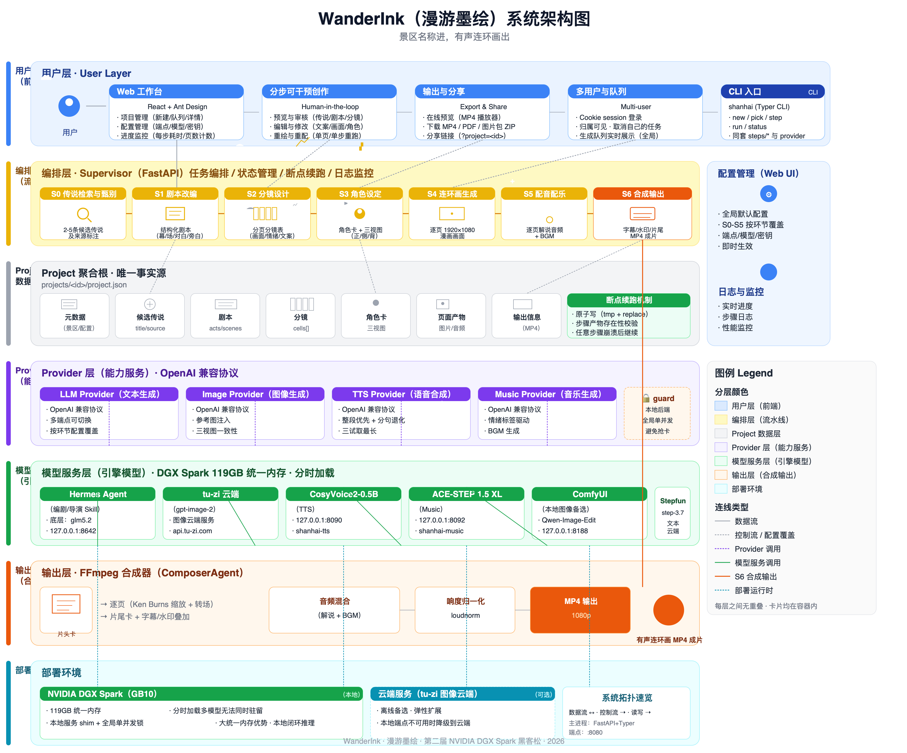

# WanderInk (Mànyóu Mòhuì) Project Documentation

> Competition: 2nd NVIDIA DGX Spark Hackathon

---

## I. Project Overview

**WanderInk (Chinese name "漫游墨绘" / Mànyóu Mòhuì)** is an end-to-end multimodal creative system for scenic spot cultural IP development. Users only need to input a scenic spot name, and the system automatically completes legend retrieval, script adaptation, storyboard design, character setting, comic page generation, voice dubbing & music composition, and video synthesis, ultimately outputting a **1080P audio comic short video** that is playable and shareable.

Core slogan:

> **Scenic spot name in, audio comic out.**

This project comprehensively upgrades the product philosophy from the 1st Spark Hackathon project [SparkScroll](https://github.com/zhanghui-china/SparkScroll): from "pure comics" to "multimedia storytelling with sound and visuals", from "direct script generation by large models" to "professionalized creation with film industry screenwriter/director skills", from "fully automated black box" to "step-by-step intervenable, re-runnable, reviewable creative workbench", and from "backend gateway focused" to "complete web application supporting multi-user collaboration with friendly interface". In addition to the team leader, this year's team has introduced more professionals with experience in film, AI engineering, and full-stack frontend/backend development.

---

## II. Product Features and Core Highlights

### 2.1 End-to-End Fully Automated Pipeline

The system breaks down scenic spot story creation into **S0–S6 seven sequential steps**, covering five modalities: text, image, speech, music, and video. A single pipeline can go from "scenic spot name" to "MP4 final product" without manual tool switching:

| Step | Name | Output |
|---|---|---|
| S0 | LEGEND Legend Retrieval and Verification | 2–5 candidate legends with source annotations |
| S1 | SCRIPT Script Adaptation | Structured script (acts/scenes/dialogues/voice-overs) |
| S2 | BOARD Storyboard Design | Page-by-page storyboard table (visual descriptions/emotions/text) |
| S3 | ROLE Character Setting | Character cards + front/side/back three-views |
| S4 | PAGES Comic Page Generation | Page-by-page 1920×1080 visuals |
| S5 | VOICE Dubbing & Music | Page-by-page narration audio + BGM |
| S6 | FILM Composite Output | MP4 with subtitles/watermark/end credits |

### 2.2 Character Consistency Without Training

The project's biggest technical highlight is the **"three-view + reference image injection"** character consistency approach:

- S3 generates front/side/back three-views for each main character;
- S4 scales three-views to 768px and passes them as image references in generation requests;
- Combined with fixed art style prefix and character feature prompts, constraining cross-page appearance.

In the M0 consistency checkpoint, the sampling evaluation of White Snake Legend with 2 characters × 3 art styles × 24 images achieved **100% zero identity drift**. Signature props (silver hairpin, paper umbrella, etc.) were preserved throughout, validating the engineering path of "maintaining high consistency without fine-tuning LoRA".

### 2.3 Audio-Visual Synchronization and Robust Audio

- S5 writes back `duration_ms` based on real audio duration, and S6 precisely calculates page length and transition offsets accordingly;
- TTS adopts "whole segment single-shot priority + truncation detection degraded to sentence-by-sentence + three tries take longest" strategy, compatible with both strong and weak models;
- When TTS is completely unavailable, the system generates a silent fallback track based on character count estimation, ensuring complete and intact final product structure.

### 2.4 Step-by-Step Intervenable Creative Workbench

Unlike completely automatic "one-click to end", WanderInk supports step-by-step confirmation by default:

- Each step's output is visualized and previewed on the frontend;
- Users can modify scripts, adjust storyboards, redraw individual pages, re-dub individual audio, and drag to reorder;
- After any step crashes, the breakpoint resume mechanism based on `project.json` only fills missing parts without redoing completed work.

### 2.5 Professional Skill-Driven

The project introduces **Hermes Agent** (configured with `Step-3.7-Flash` model underneath) to host two professional skills: "Screenwriter Master" and "Director Master", covering all text generation in S1–S3:

- **Screenwriter Master Skill**: Responsible for S1 script adaptation, outputting scripts that better conform to film narrative structures (cold opening, exposition-development-climax-resolution, ≤3 main characters);
- **Director Master Skill**: Responsible for S2 storyboard splitting and S3 character feature extraction, outputting storyboard tables with cinematographic language (wide shot/medium shot/close-up, lighting, atmosphere) and emotion tags.

The integration of Hermes injects film industry knowledge into the pipeline, upgrading generated content from "generic LLM text output" to "structured output constrained by professional creative methodologies". WanderInk simply calls the service via OpenAI-compatible protocol with `hermes-agent` as the model name, and the combination of underlying model and skill prompts is managed internally by Hermes.

---

## III. Technical Implementation Plan

### 3.1 Overall Architecture

The project adopts a **"Supervisor + Sequential Pipeline + Pluggable Provider"** architecture:

- **Single `Project` Aggregate Root**: All intermediate states (candidate legends, scripts, storyboards, character cards, page outputs, final outputs) are attached to the same Pydantic `Project` object, serialized to `projects/<id>/project.json`, serving as the single source of truth;
- **OpenAI-Compatible Provider Layer**: All four providers (LLM / Image / TTS / Music) follow OpenAI-compatible protocols, allowing endpoint, model, and key switching via `.env` or Web configuration panel with zero business code changes;
- **CLI / HTTP Dual Entry**: `shanhai` (Typer CLI) and `shanhai-web` (FastAPI) reuse the same `steps/*` and provider layer; the HTTP endpoint places pipelines in background threads, with frontend polling for progress;
- **FFmpeg Functional Synthesis**: `ffmpeg.py` constructs pure commands; S6 concatenates "opening card → page-by-page → closing card → xfade transition → loudness normalization + BGM".

#### Overall Architecture Diagram



> Source file: [architecture.svg](architecture.svg) (vector SVG, 34KB, editable)  
> Rendered output: [architecture.png](architecture.png) (1×, 322KB) · [architecture-hd.png](architecture-hd.png) (2× HD, 1.1MB)  
> Recommended to open SVG files directly in browser for best clarity.

> **Legend Explanation**:
> - Light blue = User layer (Web workbench + CLI + multi-user + AI compliance + Hermes skill)
> - Light yellow = Orchestration layer (S0–S6 seven-step pipeline, Supervisor orchestration)
> - Light gray = Project data layer (aggregate root + breakpoint resume mechanism)
> - Light purple = Provider layer (LLM / Image / TTS / Music + local_backend_guard)
> - Light green = Model service layer (Hermes / ComfyUI / Qwen-TTS / ACE-STEP + tu-zi cloud)
> - Light orange = Output layer (FFmpeg synthesizer → MP4 final product)
> - Light cyan = Deployment environment (DGX Spark local + cloud services)
> - `Project` aggregate root is the single source of truth; all steps read/write the same `project.json`, supporting breakpoint resume.
> - S0–S3 text stages all go through Hermes screenwriter/director skills (underlying glm5.2); images go through tu-zi cloud gpt-image-2.
> - Strictly drawn according to confirmed facts, no unverified data or specific numbers introduced.

#### Model and Endpoint Configuration for Each Pipeline Stage

The table below corresponds one-to-one with the architecture diagram and current `config.json` values, reflecting the "effective model / endpoint" actually called in each stage S0–S5:

| Stage | Purpose | Effective Model | Local Endpoint |
|---|---|---|---|
| S0 Legend | LLM | `Sehyo-Qwen3.5-35B-A3B-NVFP4`, `glm-4.7-flash` (local) / `Step-3.7-Flash` (cloud) | `127.0.0.1:8000` |
| S1 Script | LLM | `hermes-agent` (Screenwriter Master skill, underlying `Step-3.7-Flash`) | `127.0.0.1:8642` |
| S2 Storyboard | LLM | `hermes-agent` (Director Master skill, underlying `Step-3.7-Flash`) | `127.0.0.1:8642` |
| S3 Character Three-views | LLM + Image | LLM: `Sehyo-Qwen3.5-35B-A3B-NVFP4`, `glm-4.7-flash` (local) / `Step-3.7-Flash` (cloud)<br />Image: `gpt-image-2` (cloud) / `Qwen-Image-Edit-2511` (local) | `127.0.0.1:8091` |
| S4 Comic Pages | Image | `gpt-image-2` (cloud) / `Qwen-Image-Edit-2511` (local) | `127.0.0.1:8091` |
| S5 Dubbing/BGM | TTS + Music | `Qwen3-TTS` (local) + `ace-step-v1.5xl` (local) | `127.0.0.1:8090/8092` |

> **Notes**:
>
> - S1–S2 LLM stages all go through local Hermes Agent (`127.0.0.1:8642`), generated by `Step-3.7-Flash` model managed internally by Hermes combined with Screenwriter Master / Director Master skill prompts, constrained by film industry creative methodologies.
> - S3 three-views and S4 page-by-page images go through cloud `gpt-image-2` or local `Qwen-Image-Edit-2511`; three-views passed M0 checkpoint with 100% zero identity drift.
> - S5 dubbing and BGM are all provided locally by DGX (`shanhai-tts` :8090 running `Qwen3-TTS`, `shanhai-music` :8092 running `ACE-STEP 1.5 XL`), protected by `local_backend_guard` global single-concurrency lock.

### 3.2 Multi-Agent Role Design

| Agent | Responsibility | Underlying Capability |
|---|---|---|
| StoryAgent | Scenic spot → Historical story synopsis (S0) | Outline generation |
| ScriptAgent | Story → Script (S1) | Hermes Screenwriter Master skill |
| DirectorAgent | Script → Storyboard (S2) | Hermes Director Master skill |
| CharacterAgent | Script → Character profiles and prop descriptions (S3) | Image editing |
| ImageAgent | Character three-views, storyboard comics (S3/S4) | Image editing |
| VoiceAgent | Storyboard text → Narration voice (S5) | Speech synthesis |
| MusicAgent | Emotion tags → Background music (S5) | Music generation |
| ComposerAgent | Visuals + Voice + Music → MP4 (S6) | FFmpeg + PIL layout |

### 3.3 Key Technical Details

- **Subtitle and Visual Layering**: `compose_page()` only outputs 1920×1080 full-frame base image; `overlay_layer()` separately generates transparent PNG for subtitles and "AI Generated" watermark; ffmpeg overlay is applied after Ken Burns scaling to avoid text shaking with camera movement or watermark being cropped out of frame.
- **Atomic Write and Reentrant**: `store.save()` uses "write to `.tmp` then `os.replace`" atomic write, persisting at each step; S3 `locked` is idempotent, S4/S5 output existence validation supports breakpoint resume after any step crash.
- **Local Backend Global Single Concurrency**: `providers/_http.py` automatically identifies `127.0.0.1`/`localhost` endpoints through `local_backend_guard`, globally queuing Ollama/vllm/ComfyUI/Qwen-TTS/ACE-Step sharing GPU on DGX Spark, avoiding timeout caused by multi-task GPU contention.
- **Stage-Specific Configuration Override**: Web configuration panel supports "global default + S0–S5 stage-specific override", e.g., S1–S2 all use Hermes screenwriter/director skills (underlying glm5.2), images use cloud or local ComfyUI, taking effect without restart.

---

## IV. Architecture Design Philosophy and Optimization Plan

### 4.1 DGX Spark Platform Adaptation Philosophy

The core constraint of DGX Spark (GB10, 128GB unified memory) is "multiple models cannot reside simultaneously". Therefore, this project does not attempt to load all models at once, but adopts a strategy of **time-slice loading + local service shim + global single-concurrency lock**:

1. **Text Phase**: VLLM local LLM (`Sehyo-Qwen3.5-35B-A3B-NVFP4`) permanently resides at ~35GB;
2. **Image Phase**: Bridge to ComfyUI (`Qwen-Image-Edit-2511`) via `shanhai-image.service`;
3. **Audio Phase**: `shanhai-tts.service` (`Qwen3-TTS`) and `shanhai-music.service` (`ACE-STEP 1.5 XL`) time-share GPU;
4. **Composition Phase**: ComposerAgent consumes only ~2GB, using ffmpeg for final output.

This design fully leverages DGX Spark's platform advantages of **large unified memory, single-machine multimodal collaboration, and local closed-loop inference**.

### 4.2 Implemented Key Optimizations

| Optimization | Problem | Solution | Effect |
|---|---|---|---|
| Character Consistency | Cross-page character appearance drift | Three-view reference images + 768px scaled upload + fixed art style prefix | 100% pass M0 checkpoint |
| Vertical Image Filling | gpt-image-2 produces vertical images causing black bars | Complete frame centered + same-image blurred darkening to fill sides | Professional final product appearance |
| S4 Concurrency | Sequential page generation too slow | ThreadPool max 3, local GPU automatically serializes | ~23% speedup in cloud scenarios |
| Silent Fallback | TTS unavailability causes incomplete final product | Generate silent track based on character count estimation | End-to-end output even if TTS completely fails |
| Network Fault Tolerance | Proxy transient 503/RemoteProtocolError | Capture complete `httpx.TransportError` family with exponential backoff | Improved stability in real DGX deployment |
| Configuration Panel | Endpoint changes require file modification and restart | Web UI runtime override, persisted to `config.json` | Model switching without restart |
| GPU TTS | DGX has no online TTS | Deploy Qwen-TTS shim, PyTorch nightly adapts to GB10 sm_121 | Local human voice now working |
| AI BGM | Empty music library | ACE-STEP 1.5 XL generates pure instrumental BGM locally | S5 can now output real background music |

### 4.3 Optimization Plan

The following features have been implemented:

- **Multi-user login and queue visibility**: Cookie session + `users.json`, supports team sharing, only see own cancellation permissions;
- **National 5A scenic spot information entry**: Extracted 359 5A scenic spots from cultural and tourism bureau official website, allowing users to quickly input;

The following features are planned:

- **Multi-panel comic layout per page**: Japanese-style multi-panel storyboards for stronger pacing and visual hierarchy;
- **Character library cross-project reuse**: Store locked characters in global library, reduce redundant generation;
- **PDF refined layout and multi-language output**: Targeting B-end scenic spot operators;
- **Cost cap and redraw budget control**: Prevent remote API quota runaway;
- **Custom three-view support**: Allow users to design their own IP characters;
- **Real scenic spot image composition**: Allow users to upload real scenic spot images for comic and video composition.

---

## V. AI Compliance Handling and Sensitive Information Management

This project builds AI content compliance as a **non-disablable hard rule** into the synthesis process:

1. **"AI Generated" watermark per page**: Transparent overlay layer displays stroked watermark at fixed upper-right corner, not affected by Ken Burns camera movement;
2. **AI generation identification**: Both images and videos clearly marked with "WanderInk AI-assisted generation";
3. **Precise source annotation**: Distinguish by `source_type` between "official history / local gazette / folk legend / literary work / original interpretation", original interpretations do not impersonate legend sources;
4. **Sensitive content filtering**: S0 sends candidate legends involving religion, ethnicity, and modern political figures to sensitive review list; user manual clearly indicates such scenic spots can take "custom story" path;
5. **Child-friendly content protection**: Automatically avoid violence/horror details for child audiences;
6. **Copyright boundary**: Users uploading custom stories must self-certify rights; system outputs clearly mark source and AI generation identity.

Future planning: Introduce input/output bilateral content safety filtering API for automatic review of text-to-image prompts and generated results.

---

## VI. Deployment Plan

### 6.1 Install ComfyUI Environment

```bash
# Login as wuzi user
source ~/.bashrc

# Install dependencies
sudo apt-get install -y sox libsox-fmt-all

# Create conda environment
conda create -n comfyui python=3.12 -y
conda activate comfyui

# Download ComfyUI repository
cd ~
git clone https://github.com/comfyanonymous/ComfyUI.git

# Install PyTorch according to GPU CUDA version
pip3 install torch torchvision torchaudio --index-url https://download.pytorch.org/whl/cu130

# Install ComfyUI dependencies
cd ~/ComfyUI
pip install -r requirements.txt
```

Edit `~/.config/systemd/user/comfyui.service` to configure systemctl service:

```
[Unit]
Description=ComfyUI User Service
After=network.target

[Service]
Type=simple
WorkingDirectory=/home1/wuzi/ComfyUI
Environment="HF_ENDPOINT=https://hf-mirror.com"
ExecStart=/home1/wuzi/anaconda3/bin/conda run --no-capture-output -n comfyui python main.py --listen 0.0.0.0 --port 8188 --use-flash-attention --gpu-only
Restart=always
RestartSec=10
StandardOutput=journal
StandardError=journal

[Install]
WantedBy=default.target
```

### 6.2 Install Web Service Environment

```bash
# Login as huntun user
source ~/.bashrc

# Download repository
git clone https://github.com/zhanghui-china/WanderInk 
cd ~/WanderInk/web

# Fill in endpoints and models according to environment
cp .env.example .env   

# Create uv environment
uv sync
uv run shanhai-web

# Install web environment
cd web/web
bun install && bun run dev
```

Edit `~/.config/systemd/user/shanhai-web.service` to configure systemctl service:

```
[Unit]
Description=shanhai web (FastAPI + SPA)
After=network-online.target
Wants=network-online.target
RequiresMountsFor=%h/shanhai

[Service]
WorkingDirectory=%h/shanhai
EnvironmentFile=%h/shanhai/.env
Environment="PATH=%h/.local/bin:/usr/local/sbin:/usr/local/bin:/usr/sbin:/usr/bin:/sbin:/bin:/usr/games:/usr/local/games:/snap/bin"
ExecStart=%h/.local/bin/uv run shanhai-web
Restart=always
RestartSec=3

[Install]
WantedBy=default.target
```

Edit `~/.config/systemd/user/shanhai-image.service` to configure systemctl service:

```
[Unit]
Description=shanhai image shim (ComfyUI, OpenAI-compatible)
After=network-online.target
Wants=network-online.target
RequiresMountsFor=%h/image-shim

[Service]
WorkingDirectory=%h/image-shim
Environment="PATH=%h/.local/bin:/usr/local/sbin:/usr/local/bin:/usr/sbin:/usr/bin:/sbin:/bin"
ExecStart=%h/image-shim/.venv/bin/uvicorn main:app --host 127.0.0.1 --port 8091
Restart=always
RestartSec=5

[Install]
WantedBy=default.target
```

Edit `~/.config/systemd/user/shanhai-tts.service` to configure systemctl service:

```
[Unit]
Description=shanhai TTS shim (Qwen3-TTS VoiceDesign via ComfyUI, OpenAI-compatible)
After=network-online.target
Wants=network-online.target
RequiresMountsFor=%h/qwentts-shim

[Service]
WorkingDirectory=%h/qwentts-shim
Environment="PATH=%h/.local/bin:/usr/local/sbin:/usr/local/bin:/usr/sbin:/usr/bin:/sbin:/bin"
ExecStart=%h/qwentts-shim/.venv/bin/uvicorn main:app --host 127.0.0.1 --port 8090
Restart=always
RestartSec=5

[Install]
WantedBy=default.target
```

Edit `~/.config/systemd/user/shanhai-music.service` to configure systemctl service:

```
[Unit]
Description=shanhai music shim (ACE-Step via ComfyUI, OpenAI-compatible)
After=network-online.target
Wants=network-online.target
RequiresMountsFor=%h/music-shim

[Service]
WorkingDirectory=%h/music-shim
Environment="PATH=%h/.local/bin:/usr/local/sbin:/usr/local/bin:/usr/sbin:/usr/bin:/sbin:/bin"
ExecStart=%h/music-shim/.venv/bin/uvicorn main:app --host 127.0.0.1 --port 8092
Restart=always
RestartSec=5

[Install]
WantedBy=default.target
```

### 6.3 Install Hermes Environment

Refer to <https://zhuanlan.zhihu.com/p/2056830749530142643>

For security reasons, the hermes environment is isolated from the wanderink runtime environment to prevent hermes from deleting project code and documents after gaining high permissions.

```bash
# Login as hermes user
source ~/.bashrc

# Install dependencies
sudo apt install ripgrep

# Install hermes
curl -fsSL https://hermes-agent.nousresearch.com/install.sh | bash

# Configure hermes
hermes setup
```

### 6.4 Model Downloads

#### 6.4.1 Download LLM Model: Sehyo-Qwen3.5-35B-A3B-NVFP4

Edit file `download_model_by_modelscope_Sehyo-Qwen3.5-35B-A3B-NVFP4.py`:

```python
from modelscope import snapshot_download
import os

model_id = "hf/Sehyo-Qwen3.5-35B-A3B-NVFP4"
local_dir = "/home1/wuzi/models/"

model_dir = snapshot_download(
    model_id,
    local_dir=local_dir,
    revision='master'
)

print(f"Download completed, files saved in: {model_dir}")
```

Download the model:

```bash
python download_model_by_modelscope_Sehyo-Qwen3.5-35B-A3B-NVFP4.py
```

#### 6.4.2 Download ComfyUI Image Editing Model: Qwen-Image-Edit-2511

> [!NOTE]
> The system's `~/ComfyUI/models` directory is a symbolic link pointing to the actual storage directory `~/models/comfyui_models`. The following operations will directly download model files to the actual directory.

Download `qwen_image_edit_2511_fp8mixed.safetensors` and save it to `~/models/comfyui_models/diffusion_models/` directory.

You can download using one of the following methods:

- **Using wget (Recommended, with domestic mirror acceleration)**:

  ```bash
  export HF_ENDPOINT=https://hf-mirror.com # Domestic mirror source acceleration
  huggingface-cli download Comfy-Org/Qwen-Image-Edit_ComfyUI split_files/diffusion_models/qwen_image_edit_2511_fp8mixed.safetensors --local-dir ~/models/comfyui_models/diffusion_models --local-dir-use-symlinks False
  
  # After download, move the file to the correct root directory and clean up empty directories
  mv ~/models/comfyui_models/diffusion_models/split_files/diffusion_models/qwen_image_edit_2511_fp8mixed.safetensors ~/models/comfyui_models/diffusion_models/
  rm -rf ~/models/comfyui_models/diffusion_models/split_files
  ```

- **Using huggingface-cli**:

  ```bash
  # Create directory (if not exists)
  mkdir -p ~/models/comfyui_models/diffusion_models
  
  # Download model file
  wget -O ~/models/comfyui_models/diffusion_models/qwen_image_edit_2511_fp8mixed.safetensors \
    https://hf-mirror.com/Comfy-Org/Qwen-Image-Edit_ComfyUI/resolve/main/split_files/diffusion_models/qwen_image_edit_2511_fp8mixed.safetensors
  ```

#### 6.4.3 Download ComfyUI Speech Synthesis Model: Qwen3-TTS

Download the complete `Qwen/Qwen3-TTS-12Hz-1.7B-VoiceDesign` repository and save it to `~/models/comfyui_models/qwen-tts/Qwen3-TTS-12Hz-1.7B-VoiceDesign` directory.

You can download using one of the following methods:

- **Using huggingface-cli (Recommended, with domestic mirror acceleration)**:

  ```bash
  # Create directory (if not exists)
  mkdir -p ~/models/comfyui_models/qwen-tts/Qwen3-TTS-12Hz-1.7B-VoiceDesign
  
  # Download complete model repository
  export HF_ENDPOINT=https://hf-mirror.com # Domestic mirror source acceleration
  huggingface-cli download Qwen/Qwen3-TTS-12Hz-1.7B-VoiceDesign \
    --local-dir ~/models/comfyui_models/qwen-tts/Qwen3-TTS-12Hz-1.7B-VoiceDesign \
    --local-dir-use-symlinks False
  ```

* **Using git clone (requires git-lfs installed)**:

  ```bash
  # Clone repository to specified location
  git clone https://hf-mirror.com/Qwen/Qwen3-TTS-12Hz-1.7B-VoiceDesign ~/models/comfyui_models/qwen-tts/Qwen3-TTS-12Hz-1.7B-VoiceDesign
  ```

* **Official Hugging Face Link**:
  [Qwen3-TTS-12Hz-1.7B-VoiceDesign](https://huggingface.co/Qwen/Qwen3-TTS-12Hz-1.7B-VoiceDesign/tree/main)

#### 6.4.4 Download ComfyUI Music Generation Model: ACE-STEP XL Turbo

Download the music generation model `acestep1.5XL_ComfyUI_aio-marduk191.safetensors` and save it to `~/models/comfyui_models/checkpoints/` directory.

You can download using one of the following methods:

- **Using wget (Recommended, with domestic mirror acceleration)**:

  ```bash
  export HF_ENDPOINT=https://hf-mirror.com # Domestic mirror source acceleration
  huggingface-cli download marduk191/acestep1.5XL_ComfyUI_aio-marduk191 acestep1.5XL_ComfyUI_aio-marduk191.safetensors --local-dir ~/models/comfyui_models/checkpoints --local-dir-use-symlinks False
  ```

- **Using huggingface-cli**:

  ```bash
  # Create directory (if not exists)
  mkdir -p ~/models/comfyui_models/vae
  
  # Download model file
  wget -O ~/models/comfyui_models/vae/qwen_image_vae.safetensors \
    https://hf-mirror.com/Comfy-Org/Qwen-Image_ComfyUI/resolve/main/split_files/vae/qwen_image_vae.safetensors
  ```

- **Official Hugging Face Link**:
  [acestep1.5XL_ComfyUI_aio-marduk191.safetensors](https://huggingface.co/marduk191/acestep1.5XL_ComfyUI_aio-marduk191/tree/main)

#### 6.4.5 Download ComfyUI VAE Model

Download `qwen_image_vae.safetensors` and save it to `~/models/comfyui_models/vae/` directory.

You can download using one of the following methods:

- **Using wget (Recommended, with domestic mirror acceleration)**:

  ```bash
  export HF_ENDPOINT=https://hf-mirror.com # Domestic mirror source acceleration
  huggingface-cli download marduk191/acestep1.5XL_ComfyUI_aio-marduk191 acestep1.5XL_ComfyUI_aio-marduk191.safetensors --local-dir ~/models/comfyui_models/checkpoints --local-dir-use-symlinks False
  ```

- **Official Hugging Face Link**:
  [qwen_image_vae.safetensors](https://huggingface.co/Comfy-Org/Qwen-Image_ComfyUI/blob/main/split_files/vae/qwen_image_vae.safetensors)

#### 6.4.6 Download ComfyUI CLIP/Text Encoder Models

Download `qwen_2.5_vl_7b.safetensors` and `qwen3vl_4b_bf16.safetensors` and save them to `~/models/comfyui_models/text_encoders/` directory.

You can download using one of the following methods:

- **Using wget (Recommended, with domestic mirror acceleration)**:

```bash
# Create directory (if not exists)
mkdir -p ~/models/comfyui_models/text_encoders

# Download qwen_2.5_vl_7b
wget -O ~/models/comfyui_models/text_encoders/qwen_2.5_vl_7b.safetensors \
  https://hf-mirror.com/Comfy-Org/Qwen-Image_ComfyUI/resolve/main/split_files/text_encoders/qwen_2.5_vl_7b.safetensors

# Download qwen3vl_4b_bf16
wget -O ~/models/comfyui_models/text_encoders/qwen3vl_4b_bf16.safetensors \
  https://hf-mirror.com/Comfy-Org/Krea-2/resolve/main/text_encoders/qwen3vl_4b_bf16.safetensors
```

- **Using huggingface-cli**:

  ```bash
  # Create directory (if not exists)
  mkdir -p ~/models/comfyui_models/checkpoints
  
  # Download model file
  wget -O ~/models/comfyui_models/checkpoints/acestep1.5XL_ComfyUI_aio-marduk191.safetensors \
    https://hf-mirror.com/marduk191/acestep1.5XL_ComfyUI_aio-marduk191/resolve/main/acestep1.5XL_ComfyUI_aio-marduk191.safetensors
  ```

- **Official Hugging Face Links**:

  - [qwen_2.5_vl_7b.safetensors](https://huggingface.co/Comfy-Org/Qwen-Image_ComfyUI/blob/main/split_files/text_encoders/qwen_2.5_vl_7b.safetensors)
  - [qwen3vl_4b_bf16.safetensors](https://huggingface.co/Comfy-Org/Krea-2/blob/main/text_encoders/qwen3vl_4b_bf16.safetensors)

#### 6.4.7 Download ComfyUI LoRA Models

##### 6.4.7.1 Qwen-Image-Edit-2511

Download `Qwen-Image-Edit-2511-Lightning-4steps-V1.0-bf16.safetensors` and save it to `~/models/comfyui_models/loras/` directory.

You can download using one of the following methods:

- **Using wget (Recommended, with domestic mirror acceleration)**:

  ```bash
  # Create directory (if not exists)
  mkdir -p ~/models/comfyui_models/loras
  
  # Download LoRA model file
  wget -O ~/models/comfyui_models/loras/Qwen-Image-Edit-2511-Lightning-4steps-V1.0-bf16.safetensors \
    https://hf-mirror.com/lightx2v/Qwen-Image-Edit-2511-Lightning/resolve/main/Qwen-Image-Edit-2511-Lightning-4steps-V1.0-bf16.safetensors
  ```

- **Official Hugging Face Link**:
  [Qwen-Image-Edit-2511-Lightning-4steps-V1.0-bf16.safetensors](https://huggingface.co/lightx2v/Qwen-Image-Edit-2511-Lightning/blob/main/Qwen-Image-Edit-2511-Lightning-4steps-V1.0-bf16.safetensors)

##### 6.4.7.2 Other LoRA Models

Other LoRA models can be downloaded from civital.com and saved to `~/models/comfyui_models/loras/` directory after download.

- **LoRA Model Links**:
  - [Real_ani_qwen](https://civitai.com/models/2164588/gen-ani-art-style-qwen-lora)
  - [Qwen-image_2511_Edit_Ball-jointed_Doll V2.0](https://civitai.com/models/2303022/qwen-image2511editball-jointeddoll-v20)
  - [Nano banana figurine style](https://civitai.com/models/1900696/nano-banana-figurine-style-qwen-image-edit)

### 6.5 Download vllm Docker Image

```bash
docker pull vllm/vllm-openai:cu130-nightly
```

### 6.6 System Startup

#### 6.6.1 Start ComfyUI Service

```bash
# Login as wuzi user
source ~/.bashrc

# Start ComfyUI service
systemctl --user restart comfyui
systemctl --user status comfyui
```

The service will start on port `8188`.

#### 6.6.2 Start Web Services

```bash
# Login as huntun user
source ~/.bashrc

# Start Web, TTS, image, and music services
systemctl --user start shanhai-web shanhai-tts shanhai-image shanhai-music

# Check service status
systemctl --user status shanhai-web shanhai-tts shanhai-image shanhai-music
```

The services will start on ports `8090, 8091, 8092`.

#### 6.6.3 Start Hermes Service

```bash
# Login as hermes user
source ~/.bashrc

hermes gateway restart
```

#### 6.3.4 LLM Model Startup

##### 6.3.4.1 vllm docker startup for Qwen3.5-35B-A3B-NVFP4 model

Edit file: `/home1/wuzi/models/Sehyo/Qwen3.5-35B-A3B-NVFP4/model_qwen35_p8000.yaml`

```yaml
host: "0.0.0.0"
port: 8000
reasoning-parser: "qwen3"
enable-auto-tool-choice: true
tool-call-parser: "qwen3_xml"
dtype: auto
max-model-len: 128K
api-key: "sk-my-api-key"
disable-custom-all-reduce: true
generation-config: "vllm"
gpu-memory-utilization: 0.3
language-model-only: true
```

Edit file: `/home1/wuzi/docker/docker_start_Sehyo-Qwen3.5-35B-A3B-NVFP4.sh`

```bash
docker run -d --gpus all --rm \
       -v /home1/wuzi/models/Sehyo/:/mnt/ \
       -p 0.0.0.0:8000:8000/tcp \
       --name qwen35_35b_a3b vllm/vllm-openai:cu130-nightly /mnt/Qwen3.5-35B-A3B-NVFP4 \
       --served-model-name DGX-Qwen3.5-35B-A3B \
       --api_key "sk-my-api-key" \
       --config /mnt/Qwen3.5-35B-A3B-NVFP4/model_qwen35_p8000.yaml \
       --speculative-config '{"method": "mtp", "num_speculative_tokens": 1}'
```

Start Sehyo-Qwen3.5-35B-A3B-NVFP4 using docker:

```bash
cd /home1/wuzi/docker
chmod +x docker_start_Sehyo-Qwen3.5-35B-A3B-NVFP4.sh
sh ./docker_start_Sehyo-Qwen3.5-35B-A3B-NVFP4.sh
docker ps
docker logs [containerid]
```

##### 6.3.4.2 ollama startup for glm-4.7-flash model

Edit `~/.config/systemd/user/ollama-preload.service` to configure systemctl service:

```
[Unit]
Description=Ollama GLM Model Preloader
After=network.target

[Service]
Type=oneshot
ExecStartPre=/usr/bin/sleep 10
ExecStart=/usr/bin/curl --noproxy "*" -X POST http://127.0.0.1:11434/api/generate -d '{"model": "glm-4.7-flash:latest", "keep_alive": -1}'
RemainAfterExit=yes

[Install]
WantedBy=default.target
```

Start Ollama service:

```bash
# Login as wuzi user
source ~/.bashrc

# Start Ollama preload service
systemctl --user restart ollama-preload
systemctl --user status ollama-preload
```

The service will start on port `11434`.

---

## VII. Platform Adaptability and Technology Stack: NVIDIA SDK + NVIDIA/StepFun Models

| Layer | Technology/Model | Purpose |
|---|---|---|
| Hardware Platform | NVIDIA DGX Spark (GB10, 128GB Unified Memory) | Single machine hosting LLM + Image + TTS + Music full pipeline inference |
| LLM | Ollama (`glm-4.7-flash`), vllm (`Sehyo-Qwen3.5-35B-A3B-NVFP4`), Stepfun (`step-3.7-flash`) | Story/Script/Storyboard/Character description |
| Image | ComfyUI + `Qwen-Image-Edit-2511`, `gpt-image-2` | Three-views, storyboard comics, image editing |
| Speech | `Qwen3-TTS` | Narration dubbing |
| Music | `ACE-STEP 1.5 XL` | Background music generation |
| Orchestration | FastAPI + ThreadPool + FFmpeg | Pipeline scheduling and video composition |

NVIDIA DGX Spark's unified memory and local GPU capabilities make "single-machine closed-loop without external cloud services" possible.

### 7.1 NVIDIA and StepFun Models

#### 7.1.1 Sehyo-Qwen3.5-35B-A3B-NVFP4 Model

This project selects **Sehyo/Qwen3.5-35B-A3B-NVFP4** as one of the core text models deployed locally on DGX Spark. The model is quantized based on Qwen3.5-35B-A3B MoE architecture, maintaining the original model's capabilities while completely preserving **MTP (Multi-Token Prediction)** weights. It can further combine vLLM's **Speculative Decoding** technology to improve inference throughput, making it a cost-effective solution in the Qwen3.5 series that balances performance, cost, and deployment efficiency.

The model adopts **NVFP4 (NVIDIA Floating Point 4-bit)** quantization format natively supported by the NVIDIA Blackwell platform. NVFP4 uses a hybrid design of **FP4 weights + FP8 Scale**, significantly reducing model storage and computation overhead while preserving model accuracy as much as possible. Compared to the original BF16 model, NVFP4 achieves approximately **4x model compression ratio**, significantly reducing memory footprint and memory bandwidth pressure, thereby improving GPU data reading efficiency.

Compared with traditional INT4 quantization schemes, NVFP4 uses floating-point representation, providing better expressive ability for weights in different numerical ranges, effectively reducing quantization errors and maintaining model inference accuracy. For MoE (Mixture of Experts) models like Qwen3.5-35B-A3B, NVFP4 can better preserve the capability characteristics of each Expert, reducing the risk of performance degradation after quantization.

Relying on NVIDIA Blackwell architecture's native support for NVFP4, the model inference process can directly utilize Tensor Core for hardware acceleration, achieving higher Token generation speed and Batch throughput while ensuring generation quality. For scenarios in this project such as large model Agent, multi-round dialogue, code generation, and data analysis, it can achieve better deployment effect and operational efficiency under limited computing resources.

**Overall, Sehyo/Qwen3.5-35B-A3B-NVFP4 achieves a good balance between model capability, inference performance, memory footprint, and deployment cost, making it one of the important foundation models for DGX Spark local large model inference platform.**

#### 7.1.2 StepFun Step-3.7-Flash Model

This project integrates the **StepFun Step-3.7-Flash** large language model as one of the core text models for cloud deployment. Step-3.7-Flash is a new-generation high-performance inference model launched by StepFun. While maintaining strong comprehensive capabilities, it has been deeply optimized for inference speed, response latency, and deployment cost, providing stable and efficient model services for scenarios such as AI Agent, multi-round dialogue, code generation, knowledge Q&A, and content creation.

Compared with traditional large-parameter models, Step-3.7-Flash emphasizes **the balance between inference efficiency and actual application experience**. The model has fast first Token response speed (TTFT) and high Token output throughput, maintaining smooth interaction experience in complex task processing, especially suitable for application development needs in hackathon scenarios that require rapid iteration, real-time verification, and high-concurrency calls.

In this project, Step-3.7-Flash mainly undertakes core responsibilities such as hermes base model, scenic spot story search and source verification, and character feature generation. Benefiting from its excellent Chinese understanding ability and tool calling ability, the model can effectively support task decomposition, context reasoning, and result generation in multi-Agent workflows, providing stable and reliable intelligent core capability for the entire system.

At the same time, as an important model and computing power supporter of this AI hackathon, StepFun provides participating teams with high-performance model services and computing resource guarantees, enabling developers to focus more on product innovation and scenario implementation without paying too much attention to underlying infrastructure construction. With the capability support of Step-3.7-Flash, this project quickly completed prototype construction, functional verification, and effect optimization during the development cycle, significantly improving R&D efficiency and project delivery quality.

**Overall, Step-3.7-Flash achieves a good balance between model capability, inference efficiency, response speed, and engineering implementability, providing stable, efficient, and easy-to-integrate large model capability support for this project, making it an important infrastructure for the project's intelligent capabilities.**

#### 7.1.3 ACE Studio & StepFun ACE-Step 1.5 XL Model

This project selects **ACE-Step 1.5 XL**, jointly launched by ACE Studio and StepFun, as the core music generation model in the audio generation stage, providing high-quality soundtrack generation capability for the system. ACE-Step 1.5 XL integrates ACE Studio's technical accumulation in professional AI music generation and StepFun's capabilities in large model training and inference, automatically completing lyrics understanding, melody generation, arrangement creation, and vocal synthesis based on natural language descriptions, achieving end-to-end generation from creativity to complete music works.

Compared with traditional music generation solutions, ACE-Step 1.5 XL has significantly enhanced music structure consistency, vocal naturalness, and style control capability. The model can better understand user input themes, emotions, styles, and scene requirements, generating music works with high audibility and completeness while ensuring melody fluency. Whether it's pop, electronic, rock, Chinese style, or film soundtracks, it can achieve good style transfer and content creation effects.

In this project, ACE-Step 1.5 XL mainly undertakes tasks such as scene background music generation and audio material rapid production. Through natural language-driven music generation, the project can quickly obtain original music content that meets plot and scene requirements without professional music production team participation, significantly reducing content production threshold and improving creation efficiency. The model supports long-duration music content generation, meeting the needs of short dramas, comic videos, promotional videos, and digital content creation.

As one of the important generative AI capabilities in the StepFun ecosystem, ACE-Step 1.5 XL completes the complete AIGC content production pipeline from text generation, image generation to music generation for this project. Through collaborative work with large language models, multi-Agent systems, and visual generation models, it achieves a fully intelligent content production closed loop of "story generation — character shaping — visual creation — music production".

**Overall, ACE-Step 1.5 XL achieves a good balance between music quality, generation efficiency, and creative freedom, providing professional-level AI music creation capability for this project, making it an important part of building a multimodal content generation system.**

### 7.2 Common Tools and NVIDIA SDK

#### 7.2.1 vLLM: Text Large Model Inference Service Framework Selection

In this project, we regard large model inference capability as the core infrastructure of the entire system, rather than just simple model calls. Therefore, during the inference framework selection phase, we focused on multiple dimensions including inference performance, GPU utilization, long context support, multi-model compatibility, and future expansion capabilities. We ultimately chose **vLLM** as the unified large model inference engine, and adopted **Docker containerized deployment** to build the model service layer.

Common large model deployment solutions in the current open-source ecosystem mainly include **Ollama, llama.cpp, SGLang, and vLLM**. Among them, Ollama is more suitable for individual developers to quickly experience and deploy models locally, with advantages such as simple installation and low usage threshold. However, its positioning is more biased towards Model Runtime, and its capabilities are relatively limited in high-concurrency inference, GPU resource scheduling, and production-level service-oriented deployment. llama.cpp is known for its extreme lightweight and cross-platform capabilities, especially suitable for CPU, Mac, and edge device deployment scenarios. However, it is mainly built around the GGUF quantization ecosystem, with relatively limited support for high-end GPUs, ultra-large-scale models, and new-generation quantization formats.

SGLang and vLLM represent the development direction of large model inference frameworks for production environments in the current open-source community. SGLang has strong advantages in Structured Generation, Function Calling, and Agent workflow scenarios, while vLLM, with its mature engineering ecosystem, broader industry application verification, and deep adaptation to NVIDIA GPU ecosystem, has become one of the most widely used inference engines in enterprise-level private deployment and AI Agent platforms.

Considering project requirements and hardware environment, this project ultimately chose vLLM as the unified inference service framework. Firstly, vLLM provides an interface specification fully compatible with OpenAI API, enabling easy integration with Gateway, Agent Orchestrator, and business application layers, achieving unified encapsulation and management of model capabilities. Secondly, vLLM's core technology **PagedAttention** can significantly improve KV Cache utilization, effectively reducing memory fragmentation and memory waste, and fully releasing GPU computing resources in long context and multi-user concurrency scenarios. At the same time, vLLM supports **Continuous Batching**, which can dynamically merge inference requests from different users, improving GPU utilization and overall system throughput.

The core text model adopted in this project, **Sehyo/Qwen3.5-35B-A3B-NVFP4**, retains **MTP (Multi-Token Prediction)** weights, and vLLM already supports advanced inference optimization technologies such as **Speculative Decoding**, which can further improve Token generation speed and inference throughput. In addition, vLLM has good compatibility with NVIDIA Blackwell architecture and new-generation quantization technologies such as FP8 and FP4, enabling it to fully leverage the hardware performance advantages of the DGX Spark platform.

In terms of deployment, this project adopted the official **vLLM Docker image** for containerized deployment, rather than directly installing and running through Python environment. The main reason for this is that the large model inference environment involves many underlying dependencies such as CUDA, PyTorch, NCCL, FlashAttention, and Transformer Engine, and there are often complex compatibility relationships between different versions. Through Docker images, the entire inference environment can be standardized and encapsulated, ensuring that development, testing, and production environments remain consistent, significantly reducing deployment and operation complexity.

At the same time, the NVIDIA Blackwell GPU platform equipped in DGX Spark has high requirements for CUDA Runtime, driver version, and NVFP4 and other new features. The official image has already completed the adaptation and optimization of relevant dependency components, which can reduce environment configuration risks and improve system stability. Containerized deployment also provides good compatibility and scalability for subsequent migration to other NVIDIA GPU platforms, cloud GPU clusters, or Kubernetes environments.

In summary, the **vLLM + Docker** technical solution adopted in this project not only fully leverages the hardware performance advantages of DGX Spark and Blackwell GPU, but also achieves high-throughput, low-latency, and long-context large model inference services through core technologies such as PagedAttention, Continuous Batching, and Speculative Decoding. At the same time, this solution has good engineering capabilities, maintainability, and scalability, providing solid infrastructure support for future multi-model collaboration, multi-Agent workflows, and large-scale concurrent access scenarios.

#### 7.2.2 CUDA 13.0: GPU Computing Platform and CUDA Technology

To fully leverage the hardware performance of the NVIDIA DGX Spark platform, this project adopts **CUDA 13.0** as the underlying GPU computing runtime environment, providing unified high-performance computing infrastructure support for large model inference, multimodal content generation, and AI Agent workflows.

CUDA (Compute Unified Device Architecture) is a general-purpose parallel computing platform and programming model launched by NVIDIA, and is also the de facto standard GPU computing ecosystem in the current artificial intelligence field. Modern large model training and inference frameworks, including core components such as PyTorch, TensorRT, vLLM, FlashAttention, and Transformer Engine, are all built on the CUDA ecosystem. CUDA not only manages GPU resource scheduling and computing task execution, but also provides high-performance math libraries, communication libraries, and Tensor Core acceleration capabilities optimized for AI scenarios, serving as the foundational runtime platform for the entire AI technology stack.

Compared with early CUDA versions, CUDA 13.0 has been deeply optimized for NVIDIA's new-generation **Blackwell architecture GPU**, better supporting high-throughput computing requirements in large model inference scenarios. Especially in terms of support for low-precision computing formats such as FP8 and FP4, CUDA 13.0 provides complete software stack support, enabling new-generation quantization models to fully utilize Blackwell Tensor Core computing capabilities, significantly improving inference efficiency while ensuring model accuracy.

The core text model adopted in this project, **Sehyo/Qwen3.5-35B-A3B-NVFP4**, uses NVIDIA's proprietary NVFP4 quantization format, which achieves high compression ratio and high computing efficiency through the combination of FP4 weights and FP8 Scale. CUDA 13.0 can directly call the FP4 Tensor Core instruction set natively supported by Blackwell GPU, enabling the model inference process to complete large-scale inference tasks with lower memory footprint and higher computing throughput, thereby fully releasing the hardware potential of DGX Spark.

In terms of multi-GPU communication and inference services, CUDA 13.0 is deeply integrated with NCCL (NVIDIA Collective Communications Library), providing efficient data exchange capabilities for Tensor Parallel, Pipeline Parallel, and distributed inference scenarios. Although this project currently mainly runs in a single-node environment, when expanding to multi-GPU or GPU clusters in the future, it can still build larger-scale model service capabilities based on CUDA and NCCL, reserving sufficient space for system expansion.

In addition, CUDA 13.0 maintains high compatibility with the current mainstream AI software ecosystem. Key components including PyTorch, vLLM, TensorRT-LLM, FlashAttention, and Transformer Engine have all completed adaptation. Through a unified software stack, the project can obtain a more stable runtime environment and continuous performance optimization support, reducing compatibility risks between different components.

From an engineering practice perspective, CUDA 13.0 not only provides underlying GPU computing capabilities, but also undertakes the runtime infrastructure role of the entire AI inference platform. Tasks such as text generation, image generation, music generation, and multi-Agent collaborative inference in the project are all completed through CUDA scheduling GPU resources. With the high-performance parallel computing capabilities provided by CUDA, the system can achieve higher model throughput, lower inference latency, and better resource utilization under limited hardware resources.

In summary, CUDA 13.0, as an important software infrastructure of the NVIDIA Blackwell platform, not only provides a stable and efficient GPU computing environment for this project, but also provides key support for the high-performance operation of NVFP4 quantization models, vLLM inference engines, and multimodal generation models. Through the collaborative optimization of CUDA 13.0 and the DGX Spark platform, the project can fully leverage the advantages of the new-generation GPU architecture, providing powerful computing power guarantee for complex AI application scenarios.

#### 7.2.3 Image Generation Service Architecture Optimization — Qwen-Image-Edit-2511 Inference Solution Based on ComfyUI

In the visual content generation module of this project, we adopt **ComfyUI** as the image generation and editing workflow engine, driving the **Qwen-Image-Edit-2511** image editing model to complete core tasks such as character illustration generation, character three-view generation, comic page rendering, and visual consistency optimization.

In the first-generation hackathon project SparkScroll, the image generation service was mainly deployed based on **vLLM-Omni** and its official Docker image, calling the Qwen image model through a unified large model service framework to complete visual content generation. This solution has the advantages of simple deployment and unified interface, enabling rapid verification of product prototypes and generation pipelines. However, in actual production, we found that vLLM-Omni is more biased towards a unified inference service framework for multimodal large models, and its design goals mainly focus on model serviceization and interface standardization, rather than specialized optimization for Diffusion Models or image generation workflows. Therefore, in scenarios such as high-resolution comic page generation, complex character consistency control, and batch image processing, there is room for further optimization in GPU resource utilization and inference efficiency.

To solve this problem, this project introduces ComfyUI as a new-generation image generation execution framework. ComfyUI adopts a Node-Based visual workflow architecture, decomposing steps such as model loading, Prompt processing, sampler scheduling, LoRA loading, image editing, and post-processing into independent nodes, and organizing the execution flow through a computation graph. Compared with the traditional integrated inference call mode, ComfyUI can more flexibly manage model resources and computation processes, thereby effectively improving image generation efficiency.

In the actual deployment process, we built a dedicated image generation workflow for Qwen-Image-Edit-2511, standardizing and encapsulating links such as character setting, reference image input, style control, comic page generation, and image enhancement. At the same time, combined with ComfyUI's optimization capabilities for model caching, memory management, and inference flow, we significantly reduced performance losses caused by repeated model loading and repeated computation.

After actual testing, under the same hardware environment, the image generation solution based on vLLM-Omni in the first-generation SparkScroll project had an average generation time of approximately **5~7 minutes** for a single character three-view or comic page; after upgrading to the ComfyUI workflow, the single image generation time was stably reduced to **1~2 minutes**, with an overall inference efficiency improvement of approximately **3~5 times**. This optimization significantly shortened the waiting time from plot generation to visual output, improving the execution efficiency and user interaction experience of the entire multi-Agent creative process.

In addition to performance improvement, ComfyUI also brings stronger workflow orchestration capabilities. The character design Agent, storyboard Agent, comic generation Agent, and post-processing Agent in the project can all be called through standardized workflows, achieving modular management of the image generation process. If new diffusion models, ControlNet, LoRA, IP-Adapter, or video generation models are introduced in the future, extensions can be completed only by adjusting workflow nodes without large-scale modification of business logic code, significantly improving system maintainability and scalability.

From an architectural perspective, this upgrade reflects the project's evolution from "model call-driven" to "workflow-driven". The first-generation SparkScroll focused more on model capability verification, while this project pays more attention to the engineering efficiency of the content production pipeline. Through the introduction of ComfyUI, we not only achieved significant performance improvement, but also established a standardized generation system suitable for large-scale visual content production.

**Overall, the combination of ComfyUI and Qwen-Image-Edit-2511, while ensuring image quality and character consistency, significantly improves image generation efficiency and system expansion capabilities, providing important support for the project to achieve efficient and stable visual content production, and also laying a good technical foundation for subsequent integration of more multimodal generation models.**

#### 7.2.4 Script and Storyboard Generation Service — Multi-Agent Creative Architecture Based on Hermes Agent Framework and Shanyin Skill Service

In the content creation stage, this project adopts **Hermes Agent Framework** as the multi-Agent collaborative orchestration framework, and encapsulates **Shanyin Super Screenwriter Master** and **Shanyin Super Director Master** as professional Skill services under the Hermes system. Through HTTP API, it provides script generation and storyboard generation capabilities to upper-layer Agents, building an intelligent creative workflow for AI content production scenarios.

**Hermes** is a lightweight orchestration framework for building Agent applications in the era of large models. Its core concept is to decompose complex tasks into multiple service modules with professional capabilities through a **Agent + Skill + Tool** modular architecture, and achieve collaborative work among multiple Agents through unified task scheduling, context management, and capability calling mechanisms.

With the continuous enhancement of large language model capabilities, a single LLM can no longer meet the needs of complex business scenarios. Especially in content production fields such as film, comics, and short dramas, a complete creative process usually involves multiple professional links such as story planning, script writing, director storyboarding, art design, and music production. If only relying on a single model for end-to-end generation, problems such as unstable plot logic, drifting character settings, and insufficient camera language are likely to occur. Therefore, this project adopts Hermes as the intelligent orchestration layer, dynamically calling professional skills of screenwriters and directors through Agents to complete complex creative tasks.

[Shanyin Super Screenwriter Master]: https://github.com/Shanyin-ai/shanyin-screenwriting-master

As a script creation Skill for Hermes, it is mainly responsible for tasks such as story planning, worldview construction, character setting, and script generation.

This Skill provides standardized calling interfaces to Hermes through HTTP API, enabling Agents to call screenwriting capabilities to complete:

- Story background design;
- Character relationship construction;
- Plot structure planning;
- Plot development design;
- Complete script generation.

By encapsulating screenwriting capabilities as independent Skills, the system does not need to solidify complex creative logic in the main Agent, but can dynamically call professional capabilities according to task requirements, achieving modularization and serviceization of creative capabilities.

[Shanyin Super Director Master]: https://github.com/Shanyin-ai/shanyin-director-master

After script generation, Hermes Agent will further call the **Shanyin Super Director Master** Skill to convert literary scripts into director-level storyboard data suitable for visual generation.

This Skill is mainly responsible for:

- Plot scene decomposition;
- Camera planning;
- Shot design;
- Character action description;
- Emotion expression analysis;
- Visual composition design;
- Storyboard script generation.

Output structured scripts and storyboard content through HTTP service interfaces, providing precise Prompt and scene control information for the subsequent Qwen-Image-Edit-2511 image generation model.

Compared with directly generating image descriptions through large language models, this solution adds a professional conversion layer of "screenwriter → director → visual generation", making AI-generated content more in line with film production processes, improving plot consistency, camera continuity, and character performance capabilities.

The **Shanyin Super Screenwriter Master** and **Shanyin Super Director Master** adopted in this project are both open-source software projects. The project author [Shanyin](https://github.com/Shanyin-ai) is a well-known AIGC art creator, independent director, and screenwriter in China, with rich practical experience in AI content creation. He has won honors such as **2025 Chuxin Award Top 10 AIGC Figures of the Year, Vaca Award Top Chinese AI Visual Creative Author, and Extraordinary Award Annual AI CREATOR 100 Creator**, and participated in the construction of innovation ecosystems such as Shenzhen AIGC Super Creation Laboratory and Langyuan AI Super Creation Ecological Matrix.

He has long focused on AIGC art creation, intelligent content production processes, and AI creative tool research and development, and as a creator representative of multiple mainstream AI creation platforms, continues to promote the application of AI technology in film, visual art, and content production fields.

*The project team would like to thank **@Shanyin** for open-sourcing and contributing professional creative tools, which have provided important technical support for this project in intelligent script generation, director storyboard planning, and AI content production process optimization. With the help of these excellent open-source capability components, this project can further improve the multi-Agent collaborative creative system and accelerate the exploration and practice of AI-native content production applications.*

---

## VIII. Project Completeness

- **Functionally Complete**: All S0–S6 seven steps are fully implemented; frontend supports creating, previewing, editing, redrawing, re-dubbing, downloading MP4 video/PDF/image package;
- **Frontend-Backend Complete**: Backend FastAPI + frontend React + Vite + Tailwind, supporting multi-user, queue, and share links;
- **Stable Operation**: 300+ unit test cases covering core paths; real end-to-end has produced final products for Leifeng Pagoda, Yellow Crane Tower, etc.;
- **Documented**: Including PRD, product plan, deployment manual, user manual, decision records (decisions 0001–0006), full repository research report;
- **Demo-ready**: After inputting scenic spot name, frontend displays real-time progress and time consumption for each step, with final playable MP4.

---